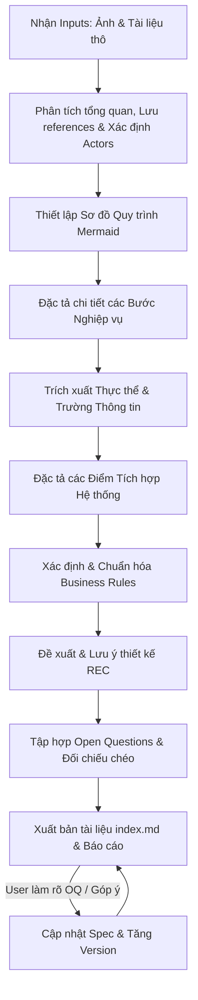

# Workflow: gen_domain_specs — Đặc tả Nghiệp vụ & Quy trình từ Ảnh và Tài liệu thô

> Hướng dẫn chi tiết để AI phân tích hình ảnh đầu vào (sơ đồ quy trình, bản vẽ tay, giao diện mockup, screenshot hệ thống cũ) cùng các tài liệu thông tin thô (notes, chats, file excel, luật, chính sách) nhằm vẽ lại workflow nghiệp vụ và sinh tài liệu đặc tả nghiệp vụ chi tiết. Quy trình này mang tính tổng quát, độc lập với công nghệ và áp dụng được cho mọi domain khác nhau (Y tế, E-commerce, Logistics, Fintech, Edtech, v.v.).

---

## 1. Overview (Tổng quan)

### Khi nào dùng

- Khi bắt đầu tiếp cận một domain hoặc phân hệ mới và có tài liệu thô/hình ảnh phác thảo từ khách hàng hoặc BA.
- Khi cần chuẩn hóa sơ đồ quy trình (workflow) nghiệp vụ từ các bản vẽ tay hoặc mô tả rời rạc thành dạng sơ đồ code-based (Mermaid) dễ bảo trì.
- Khi cần xây dựng tài liệu đặc tả nghiệp vụ (Business Specification/SRS nghiệp vụ) chi tiết, nhất quán từ nhiều nguồn thông tin rời rạc (ảnh + text).
- Cần áp dụng một khung sườn chuẩn hóa cho nhiều phân hệ/domain khác nhau mà không bị bó hẹp trong một nghiệp vụ cụ thể.

### Nguyên tắc cốt lõi

1. **Hiểu rõ bản chất nghiệp vụ (Domain-centric)**: Tập trung vào luồng xử lý nghiệp vụ thực tế, vai trò của các Actor, và các quy tắc kiểm soát, không bị phụ thuộc vào giao diện hay công nghệ cụ thể.
2. **Hình ảnh là bộ khung, Tài liệu là xương thịt**: Ảnh (sơ đồ, mockup) giúp định hình cấu trúc workflow và các thực thể; tài liệu/notes giúp điền đầy nội dung chi tiết của các bước và quy tắc nghiệp vụ.
3. **Độc lập và Tổng quát (Domain-agnostic)**: Các quy trình, biểu mẫu vẽ lại phải mang tính khái quát cao, dùng ngôn từ thuần nghiệp vụ của domain đó, tránh dùng thuật ngữ kỹ thuật (database, API, frontend/backend).
4. **Vẽ luồng trực quan (Visual workflow)**: Mọi quy trình nghiệp vụ phải được biểu diễn bằng sơ đồ Mermaid (Flowchart hoặc Sequence diagram) rõ ràng, dễ hiểu.
5. **Tính liên kết và Truy vết (Traceability)**: Mọi bước trong quy trình phải tương ứng với các quy tắc nghiệp vụ (Business Rules - BR) và các trường thông tin đầu vào/đầu ra tương ứng.
6. **Ngôn ngữ đầu ra đồng nhất (Vietnamese Output)**: Bất kể tài liệu hoặc hình ảnh nguồn đầu vào sử dụng ngôn ngữ nào (Tiếng Anh, Tiếng Nhật, Tiếng Hàn, v.v.), tài liệu đặc tả nghiệp vụ đầu ra phải được viết hoàn toàn bằng **Tiếng Việt** (ngoại trừ các thuật ngữ chuyên ngành/kỹ thuật thông dụng không thể dịch nghĩa).

---

## 2. Input & Output (Đầu vào & Đầu ra)

### 2.1 Đầu vào (Input)

| Tham số / Nguồn dữ liệu | Trạng thái | Mô tả | Ví dụ |
| :--- | :--- | :--- | :--- |
| **Ảnh nghiệp vụ** | Khuyến khích | Sơ đồ workflow vẽ tay, mockup UI, screenshot hệ thống cũ, sơ đồ khối BPMN, ảnh chụp bảng white-board... | `references/flowchart_v1.png`, `ui_mockup.jpg` |
| **Tài liệu thông tin** | Bắt buộc | File Markdown, Word, Excel, ghi chú chat, tài liệu luật/quy định, hoặc prompt mô tả trực tiếp của User. | `notes/business_requirements.md`, `specs/quy_dinh_chiet_khau.txt` |
| **Tên Domain / Phân hệ** | Bắt buộc | Tên của nghiệp vụ hoặc phân hệ cần viết đặc tả nghiệp vụ. | `Quản lý kho hàng`, `Xét duyệt khoản vay`, `Đăng ký khám bệnh` |
| **Mã định danh Domain** | Bắt buộc | Mã viết tắt để sinh mã quy tắc nghiệp vụ (BR) và thực thể. | `LOG` (Logistics), `FIN` (Finance), `HIS` (Healthcare) |

### 2.2 Đầu ra (Output)

Tài liệu được xuất ra dưới dạng Markdown chuẩn hóa, lưu tại thư mục do User chỉ định hoặc cấu trúc mặc định dưới đây:

```
docs/business-specs/
├── {domain-code}-{domain-slug}/            ← Thư mục riêng của domain
│   ├── references/                         ← Chứa ảnh tài liệu gốc đầu vào
│   │   ├── 01-original-flow.png
│   │   └── 02-original-form.png
│   └── index.md                            ← File đặc tả nghiệp vụ chính (luôn đặt tên index.md)
```

---

## 3. Quy trình thực hiện (Execution Steps)



### Bước 1: Phân tích tổng quan, Lưu references & Xác định Actors
- Khởi tạo cấu trúc thư mục đầu ra và sao chép/di chuyển toàn bộ hình ảnh, tài liệu nguồn đầu vào vào thư mục `{domain-code}-{domain-slug}/references/` để lưu trữ làm tư liệu tham chiếu lâu dài.
- Đọc kỹ ảnh (sử dụng khả năng đa phương thức - multimodal) để nhận diện các đối tượng tham gia, các bước xử lý chính và biểu mẫu đi kèm.
- Đọc tài liệu đi kèm để nắm các khái niệm cốt lõi của domain.
- Xác định danh sách **Actors** (Người dùng hệ thống, Hệ thống bên ngoài, hoặc các phòng ban nghiệp vụ như "Nhân viên kho", "Kế toán", "Khách hàng").

### Bước 2: Thiết lập Sơ đồ Quy trình (Mermaid Diagram)
- Dựng sơ đồ quy trình biểu diễn luồng đi của dữ liệu/nghiệp vụ.
- Sử dụng **Flowchart** (`graph TD` hoặc `graph LR`) cho luồng có nhiều nhánh rẽ quyết định (decision nodes).
- Sử dụng **Sequence Diagram** (`sequenceDiagram`) nếu nghiệp vụ nhấn mạnh vào sự tương tác và gửi nhận thông điệp qua lại giữa các Actor hoặc Hệ thống.
- Gắn nhãn các bước rõ ràng (ví dụ: `Bước 1: Gửi yêu cầu`, `Bước 2: Phê duyệt`).

### Bước 3: Đặc tả chi tiết các Bước Nghiệp vụ (Flow Description)
- Viết chi tiết cho từng bước nghiệp vụ đã vẽ trên sơ đồ.
- Xác định:
  - **Actor** thực hiện bước đó.
  - **Input** (Thông tin/dữ liệu cần cung cấp ở bước này).
  - **Xử lý hệ thống/nghiệp vụ** (Hệ thống hoặc con người làm gì).
  - **Output/Kết quả** (Sự thay đổi trạng thái, dữ liệu được lưu, thông báo gửi đi).
- **Nguyên tắc phân biệt Actor**: Phân biệt rõ vai trò của Actor con người và **Hệ thống** (System). Các bước xử lý hoàn toàn tự động của hệ thống (như gửi email tự động, tự tính toán số tiền, thay đổi trạng thái DB, gọi API của bên thứ ba) phải được gán cho Actor là **Hệ thống** chứ không phải Actor con người.
- Phân tách rõ ràng: **Luồng chính (Main Flow)**, **Luồng rẽ nhánh (Alternative Flows)**, và **Luồng ngoại lệ (Exception Flows)**.

### Bước 4: Trích xuất Thực thể & Trường thông tin (Information Specification)
- Từ ảnh biểu mẫu (form) hoặc tài liệu, trích xuất tất cả các trường dữ liệu cần quản lý.
- Tổ chức thành bảng thông tin chi tiết bao gồm: *Tên trường thông tin*, *Kiểu dữ liệu*, *Bắt buộc (Y/N)*, *Quy tắc kiểm tra/Ghi chú*.

### Bước 5: Đặc tả các Điểm tích hợp Hệ thống (Integration Points)
- **Trích xuất tích hợp hiện có:** Đọc tài liệu và sơ đồ đầu vào để nhận diện các hệ thống bên ngoài hoặc thiết bị cần kết nối (ví dụ: cổng thanh toán, hệ thống HIS, CRM, máy đo, v.v.). Đặc tả rõ mục đích, luồng dữ liệu (Request/Response) và phương thức kết nối (Sync/Async, Realtime/Batch).
- **Chủ động đề xuất tích hợp tối ưu:** Dựa trên domain nghiệp vụ cụ thể, đề xuất thêm các điểm tích hợp giúp tự động hóa quy trình hoặc tối ưu hóa trải nghiệm người dùng (ví dụ: hệ thống FIDS cho phòng chờ sân bay, hệ thống CRM để lấy thông tin ưu đãi, Barcode/RFID cho kho bãi). Các đề xuất này được liệt kê trong mục **Recommendations (REC)** hoặc **Open Questions** để BA/Khách hàng xác nhận.
- **Tổ chức bảng tích hợp:** Liệt kê rõ ràng các hệ thống liên kết kèm theo mục đích, dữ liệu đầu vào/đầu ra và tần suất/giao thức kết nối.

### Bước 6: Xác định & Đánh mã Quy tắc nghiệp vụ (Business Rules - BR)
- Lọc ra toàn bộ các quy tắc ràng buộc logic, công thức tính toán, hoặc điều kiện phân quyền.
- Đánh mã BR theo chuẩn quy ước (xem Mục 5).
- Tham chiếu ngược mã BR vào các bước nghiệp vụ, các trường thông tin và các điểm tích hợp tương ứng để đảm bảo tính truy vết.

### Bước 7: Phân tích Đề xuất & Lưu ý thiết kế (Recommendations & Design Considerations)
- Dựa trên kinh nghiệm thực tế phát triển phần mềm (best practices), AI đưa ra các gợi ý tối ưu hóa cho chức năng:
  - **Trải nghiệm người dùng (UX/UI):** Cách bố trí màn hình, giảm thiểu thao tác nhập liệu, các cảnh báo trước hành động nguy hiểm.
  - **Kỹ thuật & Tích hợp:** Gợi ý về hiệu năng (caching, indexing), bảo mật, gọi API bất đồng bộ (async), hoặc cơ chế tự động thử lại (retry mechanism).
  - **Tối ưu hóa quy trình (Automation):** Các đề xuất tự động hóa quy trình nghiệp vụ để giảm tải thao tác thủ công.
- Đánh số mã `REC-` tương ứng để dễ tra cứu.

### Bước 8: Tập hợp Open Questions & Đối chiếu chéo (Verification)
- Tổng hợp các điểm mâu thuẫn, mờ nhạt hoặc thiếu thông tin giữa ảnh và tài liệu thô thành mục "Câu hỏi cần làm rõ" (Open Questions).
- Thực hiện kiểm tra chéo: Đảm bảo mọi nhánh rẽ trên sơ đồ Mermaid đều có đặc tả bước tương ứng, có Business Rule/Recommendation ràng buộc cụ thể, và các điểm tích hợp được mô tả rõ.
- **Quy trình phản hồi OQ**: Khi User cung cấp câu trả lời hoặc làm rõ một câu hỏi trong mục Open Questions, Agent cần cập nhật nội dung đó vào các phần tương ứng (như Business Steps, Information Schema, Integration Points, Business Rules hoặc Recommendations), chuyển trạng thái câu hỏi đó sang dạng `[Đã giải quyết] - [Nội dung làm rõ/Thống nhất]` (hoặc gạch ngang câu hỏi đó), đồng thời cập nhật lại mục **Nhật ký thay đổi (Revision History)** với số phiên bản mới (ví dụ: `1.0.1`) kèm tóm tắt nội dung cập nhật.

---

## 4. Quy tắc vẽ sơ đồ Mermaid (Mermaid Rules)

Để sơ đồ Mermaid dễ đọc, chuyên nghiệp và tránh bị lỗi cú pháp:

1. **Quy tắc đặt tên node**:
   - Sử dụng ID ngắn gọn cho node và viết nội dung hiển thị trong dấu ngoặc kép.
     - Đúng: `step1["Bước 1: Tiếp nhận yêu cầu"]`
     - Sai: `Bước 1: Tiếp nhận yêu cầu` (Dễ lỗi cú pháp do chứa ký tự đặc biệt/dấu cách).
2. **Quy tắc vẽ quyết định (Decision)**:
   - Node quyết định dạng hình thoi `{}`, ghi rõ câu hỏi lựa chọn.
   - Các mũi tên đi ra từ node quyết định phải được gán nhãn rõ ràng (Đạt / Không đạt, Đồng ý / Từ chối).
     - Ví dụ: `check{Kiểm tra hồ sơ?} -->|Hợp lệ| approve[Phê duyệt]`
3. **Quy tắc phân luồng Actor (Swimlanes)**:
   - Nếu dùng Flowchart, sử dụng `subgraph` để nhóm các bước do cùng một Actor thực hiện.
4. **Độ phức tạp vừa phải**:
   - Chỉ nên vẽ luồng xử lý ở mức độ nghiệp vụ (logical/business flow). Không vẽ các bước kỹ thuật chi tiết như "Kết nối Database", "Trả về mã lỗi 400", "Lưu log hệ thống".

---

## 5. Quy tắc đánh mã Quy tắc Nghiệp vụ (BR) & Đề xuất Thiết kế (REC)

Mã quy tắc nghiệp vụ và các đề xuất/lưu ý thiết kế phải được đánh số nhất quán để dễ dàng tra cứu và cập nhật.

### Format mã BR:
```
BR-{DOMAIN_CODE}-{NNN}
```
- **`BR`**: Tiền tố cố định (Business Rule).
- **`{DOMAIN_CODE}`**: Mã viết tắt 3-4 ký tự viết hoa của Domain (Ví dụ: `INV` cho Inventory, `SAL` cho Sales, `PAY` cho Payment, `HRM` cho nhân sự).
- **`{NNN}`**: Số thứ tự tăng dần từ `001` đến `999`.

### Format mã REC:
```
REC-{DOMAIN_CODE}-{NNN}
```
- **`REC`**: Tiền tố cố định (Recommendation/Design Consideration).
- **`{DOMAIN_CODE}`**: Mã viết tắt 3-4 ký tự viết hoa của Domain.
- **`{NNN}`**: Số thứ tự tăng dần từ `001` đến `999`.

### Quy tắc quản lý:
- Không tái sử dụng mã BR/REC đã bị xóa. Nếu một quy tắc hay đề xuất không còn hiệu lực, giữ nguyên mã đó và ghi nhận trạng thái là `[Đã hủy bỏ] - Lý do`.
- Mọi ràng buộc dữ liệu phức tạp (như công thức tính thuế, điều kiện duyệt khoản vay) phải được tách thành một BR riêng biệt thay vì viết gộp.

---

## 6. Template Đặc tả Nghiệp vụ chuẩn (index.md)

Tất cả các tài liệu đặc tả nghiệp vụ sinh ra từ skill này phải tuân thủ nghiêm ngặt khung sườn (skeleton) 9 phần dưới đây.

````markdown
# ĐẶC TẢ NGHIỆP VỤ: [TÊN DOMAIN / PHÂN HỆ]

> **Mã phân hệ**: [Mã viết tắt - Ví dụ: INV]
> **Phiên bản**: 1.0.0
> **Ngày cập nhật**: YYYY-MM-DD
> **Tài liệu nguồn**: [Danh sách file/ảnh đầu vào được nạp]

---

## 1. Mục tiêu & Phạm vi nghiệp vụ (Goal & Scope)
*Mô tả tóm tắt mục tiêu nghiệp vụ này giải quyết vấn đề gì, đối tượng phục vụ chính là ai.*

---

## 2. Đối tượng tham gia (Actors)
*Liệt kê các bên tham gia vào quy trình nghiệp vụ này và vai trò của họ.*

| Actor | Mô tả vai trò nghiệp vụ |
| :--- | :--- |
| **[Tên Actor 1]** | [Mô tả chi tiết vai trò, quyền hạn trong quy trình] |
| **[Tên Actor 2]** | [Mô tả chi tiết vai trò, quyền hạn trong quy trình] |

---

## 3. Sơ đồ Quy trình Nghiệp vụ (Business Workflow)
*Sử dụng sơ đồ Mermaid mô tả luồng đi của nghiệp vụ.*

```mermaid
[Mã nguồn sơ đồ Mermaid ở đây]
```

---

## 4. Đặc tả chi tiết các bước nghiệp vụ (Business Steps)

### 4.1 Luồng nghiệp vụ chính (Main Flow)
*Mô tả tuần tự các bước từ khi bắt đầu đến khi kết thúc thành công.*

| Bước | Actor | Hành động & Chi tiết xử lý | Dữ liệu Đầu vào (Inputs) | Dữ liệu Đầu ra & Trạng thái (Outputs) | Liên kết Rules |
| :--- | :--- | :--- | :--- | :--- | :--- |
| **1** | [Actor A] | [Mô tả hành động của Actor A] | [Ví dụ: Thông tin yêu cầu] | [Ví dụ: Bản ghi trạng thái Khởi tạo] | `BR-XXX-001` |
| **2** | [Hệ thống] | [Hệ thống tự động thực hiện xử lý hoặc kiểm tra] | [Dữ liệu bước trước] | [Dữ liệu đã xử lý/Thông báo] | `BR-XXX-002` |

### 4.2 Luồng nghiệp vụ rẽ nhánh / thay thế (Alternative Flows)
*Mô tả các hướng đi khác tùy thuộc vào quyết định hoặc dữ liệu đầu vào.*

- **Alt-Flow [Tên bước].[Nhánh rẽ]: [Tiêu đề nhánh rẽ]**
  - Điều kiện kích hoạt: [Ví dụ: Khi hồ sơ bị thiếu thông tin ở Bước X]
  - Các bước thực hiện:
    1. [Mô tả bước xử lý thay thế]
    2. [Trở lại luồng chính hoặc kết thúc quy trình]

### 4.3 Luồng ngoại lệ / Xử lý lỗi (Exception Flows)
*Mô tả cách xử lý khi xảy ra các lỗi nghiệp vụ hoặc gián đoạn kỹ thuật.*

- **Exc-Flow [Tên bước].[Lỗi]: [Tiêu đề lỗi]**
  - Điều kiện kích hoạt: [Ví dụ: Hệ thống thanh toán bên thứ ba không phản hồi]
  - Cách xử lý: [Ví dụ: Chuyển trạng thái giao dịch sang "Thất bại", thông báo cho người dùng thực hiện lại]

---

## 5. Đặc tả thông tin nghiệp vụ (Information Schema)
*Các trường dữ liệu nghiệp vụ cần được thu thập hoặc quản lý.*

### 5.1 Thực thể: [Tên Thực thể chính - Ví dụ: Đơn hàng]

| # | Tên trường | Kiểu dữ liệu | Bắt buộc | Quy tắc xác thực & Ràng buộc nghiệp vụ |
| :--- | :--- | :--- | :--- | :--- |
| 1 | Mã đơn hàng | Text/Mã | Y | Tự động sinh theo định dạng định trước. Xem `BR-XXX-003` |
| 2 | Ngày tạo đơn | Date | Y | Mặc định là ngày hiện tại. |
| 3 | Trạng thái | Danh mục | Y | Nhận các giá trị: Mới, Đang xử lý, Hoàn thành, Hủy. |

---

## 6. Điểm tích hợp hệ thống (Integration Points)
*Đặc tả các hệ thống, dịch vụ hoặc phần cứng bên ngoài mà phân hệ này cần kết nối.*

### 6.1 Các tích hợp hiện có
*Mô tả các hệ thống liên kết đã được xác định từ tài liệu yêu cầu đầu vào.*

| Tên hệ thống liên kết | Mục đích tích hợp | Giao thức/Phương thức | Chiều dữ liệu & Nội dung chính |
| :--- | :--- | :--- | :--- |
| **[Ví dụ: Cổng thanh toán VNPay]** | Hoàn tiền tự động cho khách hàng | REST API (Sync/Realtime) | **Gửi (Request):** Mã giao dịch, Số tiền hoàn<br>**Nhận (Response):** Mã kết quả, Trạng thái hoàn tiền |

### 6.2 Các tích hợp đề xuất (Recommendations)
*Các hệ thống đề xuất kết nối thêm để tối ưu hóa quy trình và tăng tính tự động hóa.*

- **[Tên hệ thống đề xuất 1]**: [Mô tả mục đích và đề xuất giá trị mang lại cho quy trình - Ví dụ: Tích hợp CRM để tự động hoàn điểm tích lũy].

---

## 7. Quy tắc nghiệp vụ (Business Rules - BR)
*Danh sách các quy luật, ràng buộc nghiệp vụ bắt buộc hệ thống/quy trình phải tuân thủ.*

| Mã Rule | Tên Quy tắc | Mô tả chi tiết quy tắc nghiệp vụ | Nguồn tham chiếu |
| :--- | :--- | :--- | :--- |
| **BR-XXX-001** | [Tên quy tắc 1] | [Nội dung chi tiết quy tắc ràng buộc hoặc công thức tính toán] | [Tên tài liệu/Ảnh gốc] |
| **BR-XXX-002** | [Tên quy tắc 2] | [Nội dung chi tiết quy tắc ràng buộc] | [Tên tài liệu/Ảnh gốc] |

---

## 8. Đề xuất & Lưu ý thiết kế (Recommendations & Design Considerations)
*Các ý tưởng và lưu ý giúp tối ưu hóa việc phát triển tính năng này.*

| Mã Rec | Phân loại | Nội dung đề xuất / Lưu ý thiết kế | Lợi ích mang lại |
| :--- | :--- | :--- | :--- |
| **REC-XXX-001** | [UX/Kỹ thuật/Tối ưu] | [Ý tưởng đề xuất chi tiết để triển khai chức năng] | [Lợi ích mang lại cho dự án] |
| **REC-XXX-002** | [UX/Kỹ thuật/Tối ưu] | [Ý tưởng đề xuất chi tiết để triển khai chức năng] | [Lợi ích mang lại cho dự án] |

---

## 9. Câu hỏi cần làm rõ (Open Questions)
*Liệt kê các điểm chưa rõ ràng, thiếu thông tin từ tài liệu thô hoặc ảnh đầu vào cần User/BA xác nhận lại.*

- **[OQ-001]**: [Câu hỏi chi tiết về nghiệp vụ chưa rõ...]
- **[OQ-002]**: [Câu hỏi chi tiết về luồng xử lý lỗi...]

---

## 10. Nhật ký thay đổi (Revision History)

| Phiên bản | Ngày cập nhật | Người thực hiện | Nội dung thay đổi |
| :--- | :--- | :--- | :--- |
| **1.0.0** | YYYY-MM-DD | AI Agent | Khởi tạo tài liệu đặc tả nghiệp vụ ban đầu. |
| **1.0.1** | YYYY-MM-DD | AI Agent | Cập nhật theo phản hồi OQ-... |
````

---

## 7. Ví dụ đầu ra thực tế (Example Output)

Để giảm dung lượng và tránh gây nhầm lẫn trong tài liệu hướng dẫn kỹ năng, ví dụ minh họa cách viết file đặc tả nghiệp vụ cho phân hệ **"Quản lý Đổi trả sản phẩm" (Product Return Management)** đã được tách riêng.

*   Vui lòng tham khảo chi tiết cấu trúc mẫu tại đây: [EXAMPLE.md](file:///home/sotatek/LIS-local/.claude/skills/gen_domain_specs/EXAMPLE.md)

---

## 8. Quy trình Báo cáo Kết quả (Reporting)

Sau khi hoàn thành tạo mới hoặc cập nhật file đặc tả nghiệp vụ cho domain, Agent phải báo cáo tóm tắt tiến độ ở cuối phiên làm việc với cấu trúc sau:

```markdown
## Kết quả thiết lập Đặc tả Nghiệp vụ Domain: [Tên Domain]

- **Mã phân hệ (Domain Code)**: {DOMAIN_CODE}
- **Thư mục lưu trữ**: `docs/business-specs/{domain-code}-{domain-slug}/`
- **Sơ đồ quy trình đã vẽ**: [Sequence Diagram / Flowchart]
- **Số lượng bước nghiệp vụ chi tiết**: {N} bước
- **Số lượng điểm tích hợp hệ thống (Integration Points)**: {N} điểm (Trích xuất: {X}, Đề xuất: {Y})
- **Số lượng quy tắc nghiệp vụ (Business Rules) trích xuất**: {N} rules
- **Số lượng đề xuất thiết kế (Recommendations) đưa ra**: {N} recs
- **Câu hỏi cần làm rõ (Open Questions)**: {N} câu hỏi

### Tóm tắt tài liệu đã sinh
| Phân mục | Nội dung chính | Trạng thái |
| :--- | :--- | :--- |
| Sơ đồ quy trình | Biểu diễn toàn bộ luồng đổi trả/xử lý bằng Mermaid | ✅ Đã hoàn thành |
| Chi tiết các bước | Luồng chính + Rẽ nhánh + Ngoại lệ | ✅ Đã hoàn thành |
| Danh sách thực thể | Khai báo các trường dữ liệu đầu vào | ✅ Đã hoàn thành |
| Điểm tích hợp | Các cổng kết nối hiện có và đề xuất | ✅ Đã hoàn thành |
| Business Rules | Các quy định tính toán và xác thực | ✅ Đã hoàn thành |
| Recommendations | Các đề xuất tối ưu hóa UX/Kỹ thuật | ✅ Đã hoàn thành |
| Open Questions | Danh sách câu hỏi nghiệp vụ tồn đọng | ⚠️ Đợi khách hàng phản hồi |
```
