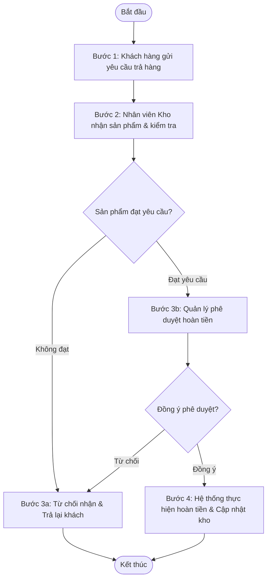

# Ví dụ đầu ra thực tế (Example Output)

Dưới đây là ví dụ minh họa cách viết file đặc tả nghiệp vụ cho phân hệ **"Quản lý Đổi trả sản phẩm" (Product Return Management)** dựa trên hình ảnh sơ đồ vẽ tay và yêu cầu sơ bộ.

````markdown
# ĐẶC TẢ NGHIỆP VỤ: QUẢN LÝ ĐỔI TRẢ SẢN PHẨM

> **Mã phân hệ**: RET (Returns)
> **Phiên bản**: 1.0.0
> **Ngày cập nhật**: 2026-07-15
> **Tài liệu nguồn**: `drawings/quy_trinh_doi_tra.png`, `notes/chinh_sach_tra_hang.txt`

---

## 1. Mục tiêu & Phạm vi nghiệp vụ (Goal & Scope)
Quy trình này quản lý việc khách hàng gửi yêu cầu trả sản phẩm đã mua và nhận lại tiền (hoàn tiền) hoặc đổi sản phẩm mới. Mục tiêu là kiểm soát chặt chẽ chất lượng sản phẩm trả về, tính toán số tiền hoàn trả chính xác và cập nhật tồn kho tự động.

---

## 2. Đối tượng tham gia (Actors)

| Actor | Mô tả vai trò nghiệp vụ |
| :--- | :--- |
| **Khách hàng** | Người khởi tạo yêu cầu đổi trả sản phẩm, cung cấp thông tin hóa đơn và lý do đổi trả. |
| **Nhân viên Kho** | Tiếp nhận sản phẩm thực tế từ khách hàng, kiểm tra tình trạng vật lý của sản phẩm và xác nhận số lượng nhận. |
| **Quản lý Cửa hàng** | Xem xét yêu cầu đổi trả, phê duyệt số tiền hoàn trả cho Khách hàng dựa trên báo cáo của Nhân viên Kho. |
| **Hệ thống** | Tự động tính toán số tiền hoàn trả, cập nhật tồn kho và gửi email thông báo trạng thái cho Khách hàng. |

---

## 3. Sơ đồ Quy trình Nghiệp vụ (Business Workflow)



---

## 4. Đặc tả chi tiết các bước nghiệp vụ (Business Steps)

### 4.1 Luồng nghiệp vụ chính (Main Flow)

| Bước | Actor | Hành động & Chi tiết xử lý | Dữ liệu Đầu vào (Inputs) | Dữ liệu Đầu ra & Trạng thái (Outputs) | Liên kết Rules |
| :--- | :--- | :--- | :--- | :--- | :--- |
| **1** | Khách hàng | Khai báo mã hóa đơn cũ và lý do trả hàng để gửi yêu cầu. | Mã hóa đơn, Lý do trả hàng, Danh sách sản phẩm muốn trả. | Bản ghi yêu cầu đổi trả ở trạng thái `Chờ nhận hàng`. | `BR-RET-001`, `BR-RET-002` |
| **2** | Nhân viên Kho | Tiếp nhận sản phẩm thực tế, đánh giá tình trạng vật lý (còn nguyên seal, nhãn mác, không hư hỏng) and xác nhận. | Sản phẩm thực tế, Mã yêu cầu đổi trả. | Biên bản kiểm kho. Cập nhật trạng thái yêu cầu sang `Đã kiểm kho - Chờ duyệt`. | `BR-RET-003` |
| **3** | Quản lý | Xem xét lý do trả hàng và biên bản kiểm kho của nhân viên kho để phê duyệt hoặc bác bỏ yêu cầu. | Bản ghi yêu cầu, biên bản kiểm kho. | Quyết định duyệt. Trạng thái chuyển sang `Đã phê duyệt`. | `BR-RET-004` |
| **4** | Hệ thống | Thực hiện lệnh hoàn tiền qua cổng thanh toán, đồng thời cộng lại số lượng sản phẩm vào tồn kho của cửa hàng. | Yêu cầu đã duyệt. | Số tiền được hoàn. Trạng thái chuyển sang `Hoàn thành`. Gửi email báo khách hàng. | `BR-RET-005` |

### 4.2 Luồng nghiệp vụ rẽ nhánh / thay thế (Alternative Flows)

- **Alt-Flow 2.A: Khách hàng muốn đổi sang sản phẩm khác thay vì hoàn tiền**
  - Điều kiện kích hoạt: Tại Bước 1, khách hàng tick chọn hình thức "Đổi sản phẩm" thay vì "Hoàn tiền".
  - Các bước thực hiện:
    1. Nhân viên kho kiểm tra sản phẩm trả đạt yêu cầu (tương tự Bước 2).
    2. Nhân viên kho xuất sản phẩm mới thay thế từ kho.
    3. Hệ thống ghi nhận đơn đổi trả có giá trị chênh lệch bằng 0 (hoặc thu thêm/hoàn lại phần chênh lệch giá).
    4. Trạng thái chuyển sang `Hoàn thành đổi hàng`.

### 4.3 Luồng ngoại lệ / Xử lý lỗi (Exception Flows)

- **Exc-Flow 4.A: Hoàn tiền qua cổng thanh toán bị lỗi**
  - Điều kiện kích hoạt: Tại Bước 4, hệ thống gọi cổng thanh toán ngân hàng nhưng bị từ chối hoặc hết thời gian phản hồi (timeout).
  - Cách xử lý:
    1. Hệ thống chuyển trạng thái yêu cầu sang `Lỗi hoàn tiền`.
    2. Gửi cảnh báo (Alert) cho Quản lý cửa hàng và Kế toán để xử lý thủ công (chuyển khoản tay).

---

## 5. Đặc tả thông tin nghiệp vụ (Information Schema)

### 5.1 Thực thể: Yêu cầu Đổi trả (Return Request)

| # | Tên trường | Kiểu dữ liệu | Bắt buộc | Quy tắc xác thực & Ràng buộc nghiệp vụ |
| :--- | :--- | :--- | :--- | :--- |
| 1 | Mã yêu cầu trả | Text | Y | Tự sinh định dạng: `RET-YYYYMMDD-XXXX` (X là số tự tăng). |
| 2 | Mã hóa đơn gốc | Text | Y | Phải tồn tại trên hệ thống và thuộc về tài khoản khách hàng. |
| 3 | Hình thức đổi trả | Option | Y | Nhận giá trị: `Hoàn tiền` hoặc `Đổi sản phẩm`. |
| 4 | Trạng thái | Option | Y | Các trạng thái: `Chờ nhận hàng`, `Đã kiểm kho`, `Đã phê duyệt`, `Đã từ chối`, `Hoàn thành`, `Lỗi hoàn tiền`. |
| 5 | Giá trị hoàn tiền | Decimal | Y | Tự động tính toán dựa trên giá bán thực tế tại hóa đơn gốc. Xem `BR-RET-005` |

---

## 6. Điểm tích hợp hệ thống (Integration Points)

### 6.1 Các tích hợp hiện có
*Mô tả các hệ thống liên kết đã được xác định từ tài liệu yêu cầu đầu vào.*

| Tên hệ thống liên kết | Mục đích tích hợp | Giao thức/Phương thức | Chiều dữ liệu & Nội dung chính |
| :--- | :--- | :--- | :--- |
| **Cổng thanh toán (Paygate)** | Hoàn tiền tự động cho khách hàng khi yêu cầu được duyệt thành công (Bước 4). | REST API (Sync - Realtime) | **Gửi (Request):** Mã giao dịch gốc, Số tiền hoàn lại, Lý do hoàn.<br>**Nhận (Response):** Trạng thái hoàn tiền (Thành công/Thất bại), Mã tham chiếu giao dịch hoàn. |

### 6.2 Các tích hợp đề xuất (Recommendations)
*Các hệ thống đề xuất kết nối thêm để tự động hóa và tối ưu quy trình xử lý.*

- **Hệ thống Vận chuyển bên thứ ba (3PL Link):** Tích hợp với dịch vụ giao hàng (Giao Hàng Nhanh, Viettel Post, v.v.) để tự động tạo đơn hàng thu hồi (Return Order Pickup) ngay khi yêu cầu đổi trả được chuyển sang trạng thái `Chờ nhận hàng`. Giúp rút ngắn thời gian thu hồi và khách hàng không cần tự đem hàng đi gửi.
- **Hệ thống CRM & Membership:** Tích hợp để tự động khấu trừ điểm tích lũy của khách hàng đã nhận từ đơn hàng gốc khi sản phẩm bị trả, hoặc tự động hoàn trả lại Voucher/Mã giảm giá đã dùng trong đơn hàng cũ.

---

## 7. Quy tắc nghiệp vụ (Business Rules - BR)

| Mã Rule | Tên Quy tắc | Mô tả chi tiết quy tắc nghiệp vụ | Nguồn tham chiếu |
| :--- | :--- | :--- | :--- |
| **BR-RET-001** | Thời gian đổi trả hợp lệ | Khách hàng chỉ được gửi yêu cầu đổi trả trong vòng tối đa 15 ngày kể từ ngày nhận hàng thành công ghi nhận trên hóa đơn gốc. | `chinh_sach_tra_hang.txt` |
| **BR-RET-002** | Sản phẩm không được phép trả | Các sản phẩm thuộc danh mục "Khuyến mãi giảm giá sâu (>50%)" hoặc "Hàng thanh lý" không được áp dụng chính sách đổi trả này. | `chinh_sach_tra_hang.txt` |
| **BR-RET-003** | Tình trạng sản phẩm đạt yêu cầu | Sản phẩm trả về phải còn nguyên tem mác, chưa qua sử dụng, không bị trầy xước, vỡ nứt hoặc dơ bẩn do lỗi của người dùng. | `quy_trinh_doi_tra.png` |
| **BR-RET-004** | Hạn mức phê duyệt | Quản lý cửa hàng được duyệt các yêu cầu hoàn tiền trị giá dưới 5.000.000 VNĐ. Các yêu cầu từ 5.000.000 VNĐ trở lên phải do Giám đốc khu vực phê duyệt. | Ghi chú từ cuộc họp BA |
| **BR-RET-005** | Công thức tính hoàn tiền | Số tiền hoàn lại = (Giá trị sản phẩm trên hóa đơn gốc - Giá trị khuyến mãi đã phân bổ cho sản phẩm đó) - Phí thu hồi hàng (nếu có, mặc định bằng 0). | Quy định kế toán |

---

## 8. Đề xuất & Lưu ý thiết kế (Recommendations & Design Considerations)

| Mã Rec | Phân loại | Nội dung đề xuất / Lưu ý thiết kế | Lợi ích mang lại |
| :--- | :--- | :--- | :--- |
| **REC-RET-001** | UX/UI | Ở màn hình nhập lý do trả hàng (Bước 1), nên hiển thị danh mục các lý do mẫu (lỗi kỹ thuật, đổi ý, sai kích cỡ) dạng dropdown thay vì để người dùng tự gõ text tự do. | Chuẩn hóa dữ liệu đầu vào để phân tích nguyên nhân đổi trả, tăng tốc độ nhập liệu của khách hàng. |
| **REC-RET-002** | Kỹ thuật | Việc gọi API hoàn tiền của Cổng thanh toán (Bước 4) nên được đẩy vào hàng đợi xử lý bất đồng bộ (Queue Job) với cơ chế tự động thử lại tối đa 3 lần nếu gặp lỗi kết nối tạm thời. | Tránh tình trạng treo UI của nhân viên và tăng tỷ lệ thành công của giao dịch hoàn tiền tự động. |
| **REC-RET-003** | Tối ưu hóa | Tích hợp hệ thống thông báo tự động (SMS/Email/Zalo) để gửi mã vận đơn gửi hàng cho Khách hàng ngay khi yêu cầu đổi trả được chuyển sang trạng thái `Chờ nhận hàng`. | Khách hàng chủ động biết địa điểm và phương thức gửi hàng, giảm tải cuộc gọi hỗ trợ cho CSKH. |

---

## 9. Câu hỏi cần làm rõ (Open Questions)

- **[OQ-RET-001]**: Đối với các hóa đơn thanh toán bằng Voucher/Điểm tích lũy, khi hoàn tiền có hoàn lại Voucher/Điểm hay chỉ hoàn tiền mặt? (Chưa thấy tài liệu nguồn đề cập).
- **[OQ-RET-002]**: Chi phí vận chuyển trả hàng do ai chịu? Khách hàng tự mang đến cửa hàng hay có shipper đến lấy?

---

## 10. Nhật ký thay đổi (Revision History)

| Phiên bản | Ngày cập nhật | Người thực hiện | Nội dung thay đổi |
| :--- | :--- | :--- | :--- |
| **1.0.0** | 2026-07-15 | AI Agent | Khởi tạo tài liệu đặc tả nghiệp vụ quản lý đổi trả sản phẩm ban đầu. |

````
