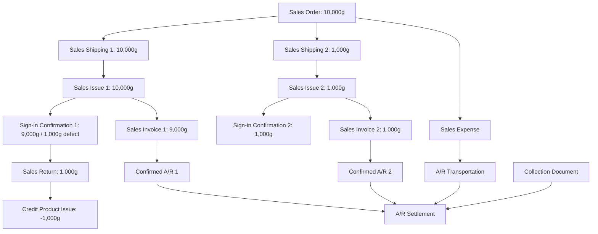

# 📋 HƯỚNG DẪN THAO TÁC - BÀI TẬP INVENTORY MANAGEMENT (23/07/2026)

> **Khóa học**: YonSuite Partner Implementation Training - SCM Inventory Management
> **Giảng viên**: James Cheng
> **Product Version**: YonSuite Professional v20260515

---

## 🏗️ TRƯỚC KHI LÀM: Chuẩn bị hệ thống (System Preparation)

Cần kiểm tra các thiết lập sau đã có sẵn chưa:

### 3.1 Master Data

| # | Mục | Đường dẫn menu | Ghi chú |
|---|-----|---------------|---------|
| 1 | **Business Unit** | `Yon Application > Digital Modeling > Organization Management > Organization` | Bật **Purchasing Organization** và **Inventory Organization** |
| 2 | **Department** | `Yon Application > Digital Modeling > Organization Management > Organization` | Chọn Administrative Org → New Sibling → Tạo phòng ban |
| 3 | **Warehouse (Kho)** | `Yon Application > Master Data > Shipping Information > Warehouse Information` | **Calculate Cost = Yes** → phải cấu hình Cost Area. Nếu cần Bin Management → bật **Storage Bin Management = Yes** |
| 4 | **Storage Bin** | `Yon Application > Master Data > Shipping Information > Warehouse Information > Storage Bin` | Không bắt buộc, thiết lập Bin theo cấu trúc nhiều tầng nếu cần |
| 5 | **Supplier (NCC)** | `Yon Application > Master Data > Suppliers Information` | Thiết lập tax rate, currencies, payment terms mặc định |
| 6 | **Customer (KH)** | `Yon Application > Master Data > Customers Information` | Tương tự Supplier |
| 7 | **Material (Vật liệu)** | `Yon Application > Master Data > Material` | Đánh dấu **Purchasable**. Value Management Mode: **Inventory Accounting** (vật liệu kho), Expense (dịch vụ/tiêu hao), Fixed Assets (tài sản cố định). Cấu hình Batch Management, Safety Stock nếu cần |

### 3.2 Basic Settings

| # | Mục | Đường dẫn menu | Ghi chú |
|---|-----|---------------|---------|
| 8 | **Transaction Type** | `Yon Application > Business Model Management > Business Model Management > Object Modeling > Transaction Type` | Dùng mặc định hoặc tạo mới theo yêu cầu |
| 9 | **Business Process** | `Yon Application > Digital Modeling > Business Process > Business Process > Business Process Design` | Kéo thả để thiết kế flow |
| 10 | **Work Flow** | `Yon Application > Digital Modeling > Workflow > Workflow` | Kéo thả, định nghĩa multi-level approval |
| 11 | **Warehouse Material Relationship** | `SCM Cloud > Material Management > Inventory Management > Settings > Warehouse Material Relationship` | Định nghĩa quan hệ Kho-Vật liệu. Có thể để Prompt hoặc Strict Control |
| 12 | **Storage Bin Material Cross-Reference** | `Yon Application > Master Data > Shipping Information > Warehouse Information > Storage Bin Material Cross-Reference` | Gán Bin với Material, có thể định nghĩa độ ưu tiên |
| 13 | **Inventory Status** | `SCM Cloud > Supply Chain Public > Settings > Inv Status` | Qualified / Pending Inspection / Frozen / Unqualified / Scrap |
| 14 | **Available Quantity Management** | `SCM Cloud > Material Management > Inventory Management > Settings > Calculation Rules of Available Quantity` | Cấu hình công thức tính SL khả dụng |
| 15 | **Available Quantity Check Rule** | `SCM Cloud > Material Management > Inventory Management > Settings > Available Quantity Check Rule` | Strict Control / Do Not Check, thời điểm Save hoặc Approve |
| 16 | **Available Quantity Rule Allocation** | `SCM Cloud > Material Management > Inventory Management > Settings > Available Quantity Rule Allocation` | Phân bổ rule cho từng đơn vị |

### 3.3 Inventory Parameters

| # | Mục | Đường dẫn menu | Ghi chú |
|---|-----|---------------|---------|
| 17 | **Inventory Parameters** | `SCM Cloud > Material Management > Inventory Management > Inventory Business Parameters` | Cấu hình: Allow Issue Quantity Exceed, Receipt/Issue Method (One-step/Two-step), Stocktaking params |
| 18 | **Issue/Receipt Method** | *(Trong Inventory Parameters)* | **One Step**: Lưu → cập nhật tồn kho ngay. **Two Step**: Lưu → Confirm mới cập nhật |
| 19 | **Stocktaking Params** | *(Trong Inventory Parameters)* | Bật/tắt: VMI stock, hiển thị Book Qty, tự động hiển thị từ Plan |

### 3.4 Financial Data & Opening Data

| # | Mục | Đường dẫn menu | Ghi chú |
|---|-----|---------------|---------|
| 20 | **Account Book** | `Finance Cloud > Intelligent Accounting Middle Platform > Accounting Common Settings > Accounting Book Center` | Mở kỳ: GL, Inventory Accounting, A/R, A/P, Fixed Assets |
| 21 | **Cost Area** | `Finance Cloud > Financial Accounting > Inventory Accounting > Basic Settings` | Gán Cost Area cho Inventory Organization và Warehouse |
| 22 | **Opening Inventory** | `SCM Cloud > Material Management > Inventory Management > Inv Receipt/Issue > Opening Inventory` | Nhập tồn kho đầu kỳ (từng dòng hoặc import Excel) |

---

## 📝 BÀI 1: TRANSFORMATION (Chuyển đổi vật liệu)

> **Mục tiêu**: Thực hiện chuyển đổi vật liệu và submit **Document Flow**.
> **Process Code**: S2P-P05-b02-01
> **Process**: Form Conversion → Inventory Adjustment

### 3 Loại Chuyển Đổi

| Loại | Mô tả | Quy tắc chi phí |
|------|-------|----------------|
| **One-to-One** | VL A → VL B. Có thể đổi số lượng, kho, batch | Cost B = Cost A |
| **Many-to-One** (Assembly) | VL A,B,C... → BOM A+ | Cost A+ = Σ(A,B,C...) |
| **One-to-Many** (Disassembly) | BOM A+ → A,B,C... (kèm trọng số) | Phân bổ chi phí A+ cho A,B,C theo trọng lượng |

### Quy trình thao tác từng bước:

| Bước | Thao tác | Chi tiết |
|------|---------|---------|
| **1** | 🖥️ Vào menu | `SCM Cloud > Material Management > Inventory Management > Inventory Adjustment > Transformation` |
| **2** | ➕ Tạo mới | Click **"Add"** / **"New"** |
| **3** | ⚙️ Chọn loại | Chọn **Transaction Type** và **Conversion Type**: `One-to-One` / `Many-to-One` / `One-to-Many` |
| **4** | 📦 Add Group | Click **"Add Group"** để tạo nhóm chuyển đổi (mỗi nhóm = 1 cặp trước/sau) |
| **5** | ⬅️ Nhập Before | **Dòng trên**: Mã VL nguồn → Số lượng → Kho xuất → Batch (nếu có) |
| **6** | ➡️ Nhập After | **Dòng dưới**: Mã VL đích → Số lượng → Kho nhận → Batch mới |
| **7** | ⚖️ Trọng số (nếu 1-Nhiều) | Nhập **Allocated Weight** để phân bổ chi phí |
| **8** | 💾 Lưu | Click **"Save"** |
| **9** | ✅ Phê duyệt | Click **"Submit"** / **"Approve"** |
| **10** | 🔍 Kiểm tra kết quả | Hệ thống tự động sinh: |

### Kết quả mong đợi:

```
Transformation Document (đã phê duyệt)
    ├── 🔵 Other Goods Issue (xuất VL cũ)
    ├── 🟢 Other Goods Receipt (nhập VL mới)
    └── 📊 Cặp bút toán kế toán (Pairwise Issue/Receipt Accounting)
```

### ✅ Checklist nộp bài:
- [ ] Chụp màn hình **Document Flow** (luồng chứng từ)
- [ ] Đảm bảo hiển thị đủ: Transformation → Goods Issue + Goods Receipt + Accounting

---

## 📝 BÀI 2: STOCK TAKING (Kiểm kê cuối năm)

> **Mục tiêu**: Hoàn thành quy trình kiểm kê và submit **Document Flow**.
> **Process Code**: S2P-P05-b05-01
> **Process**: Inventory Task → Inventory Record → Inventory Discrepancy → Inventory Gain/Inventory Loss

### Quy trình thao tác từng bước:

| Bước | Actor | Thao tác | Chi tiết |
|------|-------|---------|---------|
| **1** | 👔 Phòng TC | 🖥️ Vào menu | `SCM Cloud > Material Management > Inventory Management > Stocktaking > Closing Stocktaking` |
| **2** | 👔 Phòng TC | ➕ Tạo Plan | Click **"Add"** → Tạo **Review Plan** (Kế hoạch kiểm kê) |
| **3** | 👔 Phòng TC | ⚙️ Chọn phạm vi | Chọn **Transaction Type**, **Warehouse**, và **Stocktaking Range**: |
| | | | • 📦 **Whole Warehouse** - Toàn bộ kho |
| | | | • 📂 **Specified Category** - Theo danh mục |
| | | | • 🏷️ **Specified Materials** - Theo vật liệu cụ thể |
| **4** | 👔 Phòng TC | 📸 Chụp Snapshot | Click **"Generate Snapshot"** → Hệ thống ghi nhận **Book Quantity** tại thời điểm kiểm kê |
| **5** | 👷 Thủ kho | 🔢 Nhập SL thực tế | Vào tab **"Input Physical Inventory"** → Nhập số lượng kiểm đếm thực tế từng dòng |
| **6** | ⚙️ Hệ thống | 📊 Tính chênh lệch | Hệ thống tự động tính: |
| | | | `Chênh lệch = SL Thực tế - SL Sổ sách - SL Giao dịch PS` |
| **7** | 👔 Phòng TC | 🔍 Xem xét | Vào tab **"Counting Review"** → Xem báo cáo Gain/Loss |
| **8** | 👔 Phòng TC | ✅ Xác nhận | Click **"Result Confirmation"** → Phê duyệt kết quả kiểm kê |
| **9** | ⚙️ Hệ thống | 🔍 Tự động sinh | Hệ thống tự động sinh chứng từ điều chỉnh |

### Kết quả mong đợi:

```
Stocktaking Plan (Review Plan)
    ├── 📸 Inventory Snapshot (Book Quantity)
    ├── 🔢 Physical Inventory (Actual Count)
    ├── 📊 Counting Review (Gain/Loss Discrepancy)
    ├── ✅ Result Confirmation
    │       ├── 🟢 Hàng THỪA (Gain) → Other Goods Receipt
    │       └── 🔵 Hàng THIẾU (Loss) → Other Goods Issue
    └── 📊 Bút toán kế toán điều chỉnh
```

### 🔑 Các điểm cần lưu ý:

| Tham số | Ý nghĩa |
|---------|---------|
| **Comp Stock on Book = Yes** | Thủ kho **thấy** Book Qty khi nhập số liệu kiểm kê |
| **Comp Stock on Book = No** | Thủ kho **không thấy** Book Qty → nhập mù (kiểm soát chặt hơn) |
| **Calculate Period Transactions = Yes** | Hệ thống tự tính bù trừ giao dịch phát sinh trong thời gian kiểm kê |
| **Calculate Period Transactions = No** | Mọi giao dịch phải **đóng băng** trong thời gian kiểm kê |

### So sánh 2 loại kiểm kê:

| | Closing Stocktaking (Cuối năm) | Daily Stocktaking (Hàng ngày) |
|---|---|---|
| **Menu** | Stocktaking > Closing Stocktaking | Stocktaking > Daily Stocktaking |
| **Cần Plan?** | ✅ Có - Phòng TC tạo trước | ❌ Không - Thủ kho tạo trực tiếp |
| **Actor chính** | Phòng TC + Thủ kho | Thủ kho / QL Kho |
| **Phạm vi** | Toàn bộ kho / Danh mục / VL cụ thể | VL cụ thể, khu vực nhỏ |

### ✅ Checklist nộp bài:
- [ ] Chụp màn hình **Document Flow** (luồng chứng từ)
- [ ] Đảm bảo hiển thị đủ: Plan → Physical Inventory → Counting Review → Gain/Loss Adjustment

---

## 📝 BÀI 3: SCRAP - SCENARIO 2 (Xử lý phế liệu - Hủy trực tiếp)

> **Mục tiêu**: Hoàn thành Scrap Scenario 2 (Issue Only) và submit **Document Flow**.
> **Process Code**: S2P-P05-b03-01
> **Process**: Scrap Material Order → Material Outbound → Accounting Adjustment

### Quy trình thao tác từng bước:

| Bước | Thao tác | Chi tiết |
|------|---------|---------|
| **1** | 🖥️ Vào menu | `SCM Cloud > Material Management > Inventory Management > Inventory Adjustment > Scrap` |
| **2** | ➕ Tạo mới | Click **"Add"** / **"New"** |
| **3** | ⚙️ Chọn loại GD | Chọn **Transaction Type = "Scrap (Issue Only)"** |
| | | ⚠️ Trong cấu hình Transaction Type: Chọn **"Yes"** cho `Only Generate Scrap Issue After Approval` |
| **4** | 🏢 Chọn tổ chức | Chọn **Inventory Organization** |
| **5** | 🏭 Chọn VL | Chọn **Warehouse** (kho nguồn), tìm và chọn **Material** cần xử lý phế liệu |
| **6** | 🔢 Nhập SL | Nhập **Adjustment Quantity** (số lượng cần hủy) |
| **7** | 🚫 Không chọn kho đích | **Không** chọn Transfer In Warehouse (vì Scenario 2 là hủy trực tiếp) |
| **8** | 💾 Lưu | Click **"Save"** |
| **9** | ✅ Phê duyệt | Click **"Submit"** / **"Approve"** (đề xuất thiết lập workflow phê duyệt) |
| **10** | 🔍 Kiểm tra kết quả | Hệ thống chỉ sinh Other Goods Issue |

### Kết quả mong đợi:

```
Scrap Document (Issue Only - đã phê duyệt)
    ├── 🔵 Other Goods Issue (xuất hủy)
    │       └── Material B → ❌ throw away (hủy vĩnh viễn)
    └── 📊 Bút toán kế toán (xuất kho giảm giá trị)
```

### 🔄 So sánh 2 Scenario của Scrap:

| | Scenario 1 | Scenario 2 ⭐ **(Bài tập)** |
|---|---|---|
| **Transaction Type** | Scrap | Scrap (Issue Only) |
| **Only Generate Scrap Issue** | No | **Yes** |
| **Kho phế liệu đích?** | ✅ Có - chọn Transfer In Warehouse | ❌ Không |
| **Chứng từ sinh ra** | 🔵 Goods Issue + 🟢 Goods Receipt | 🔵 Chỉ Goods Issue |
| **Kết quả** | VL A → Scrap Warehouse → thanh lý sau | VL B → **throw away** (hủy ngay) |
| **Phù hợp khi** | Cần theo dõi phế liệu tồn, có giá trị thu hồi | Không cần theo dõi, hủy trực tiếp |

### ✅ Checklist nộp bài:
- [ ] Chụp màn hình **Document Flow** (luồng chứng từ)
- [ ] Đảm bảo hiển thị đủ: Scrap (Issue Only) → Goods Issue + Accounting
- [ ] Lưu ý: **Không** có Goods Receipt (đây là điểm khác Scenario 1)

---

## 📊 TÓM TẮT TOÀN BỘ NAVIGATION PATH

```
SCM Cloud > Material Management > Inventory Management
│
├── 📥 Inv Receipt/Issue
│   ├── Opening Inventory .................. Nhập tồn kho đầu kỳ
│   ├── Other Goods Issue .................. Xuất kho khác
│   └── Other Goods Receipt ................ Nhập kho khác
│
├── 🔄 Inventory Adjustment
│   ├── Transformation ............... ⭐ BÀI 1
│   ├── Scrap ........................ ⭐ BÀI 3
│   └── Stock Transfer ............... Chuyển kho nội bộ
│
├── 📋 Stocktaking
│   ├── Closing Stocktaking .......... ⭐ BÀI 2
│   └── Daily Stocktaking ............ Kiểm kê hàng ngày
│
├── ⚙️ Settings
│   ├── Warehouse Material Relationship
│   ├── Calculation Rules of Available Quantity
│   ├── Available Quantity Check Rule
│   └── Available Quantity Rule Allocation
│
├── 📊 Inventory Business Parameters

└── 📈 Reports
    ├── On-hand Stock Query ........... Truy vấn tồn kho hiện có
    ├── Stock Aging Analysis ........... Phân tích tuổi tồn kho
    └── Issue/Receipt Query ............ Truy vấn nhập/xuất
```

---

## 🎯 TỔNG KẾT 7 QUY TRÌNH INVENTORY MANAGEMENT

| # | Process Code | Quy trình | Các bước chính | Menu Path |
|---|-------------|----------|---------------|-----------|
| 1 | S2P-P05-b02-01 | **Transformation** | Form Conversion → Inventory Adjustment | `Inventory Adjustment > Transformation` |
| 2 | S2P-P05-b03-01 | **Scrap** | Scrap Order → Material Outbound → Accounting Adj. | `Inventory Adjustment > Scrap` |
| 3 | S2P-P05-b04-01 | **Stock Transfer** | Warehouse Stock Transfer Order | `Inventory Adjustment > Stock Transfer` |
| 4 | S2P-P05-b05-01 | **Year-End Stocktaking** | Task → Record → Discrepancy → Gain/Loss | `Stocktaking > Closing Stocktaking` |
| 5 | S2P-P05-b05-02 | **Daily Inventory Check** | Task → Record → Discrepancy → Gain/Loss | `Stocktaking > Daily Stocktaking` |
| 6 | S2P-P05-b07-01 | **Other Goods Issue** | Issue Order → Outbound → Financial Adj. | `Inv Receipt/Issue > Other Goods Issue` |
| 7 | S2P-P05-b07-02 | **Other Goods Receipt** | Receipt Order → Receipt → Financial Adj. | `Inv Receipt/Issue > Other Goods Receipt` |

---

## ⚠️ LƯU Ý QUAN TRỌNG

1. **Document Flow**: Khi chụp màn hình nộp bài, phải hiển thị được **luồng chứng từ** (document flow) thể hiện mối liên kết giữa các chứng từ được sinh ra tự động.

2. **Thứ tự thao tác**: Làm theo đúng thứ tự bước trong từng quy trình - không được bỏ qua bước phê duyệt.

3. **Workflow**: Đề xuất thiết lập workflow phê duyệt cho Scrap và Transformation để có document flow đầy đủ hơn.

4. **One-step vs Two-step**: Kiểm tra Inventory Parameter để biết hệ thống đang dùng phương thức nào - ảnh hưởng đến thời điểm cập nhật tồn kho.

5. **Opening Inventory**: Đảm bảo đã nhập tồn kho đầu kỳ trước khi thực hiện các nghiệp vụ điều chỉnh.

---

> 📅 **Ngày học**: July 23, 2026
> 📄 **Slide nguồn**: YonSuite Partner Implementation Training_SCM_Inventory Mangement_20260723(with Homework).pdf

---

## 📝 BÀI 4: SALES MANAGEMENT (Quản lý Bán hàng & Trả hàng)

> **Mục tiêu**: Thực hiện quy trình bán hàng theo kịch bản bài tập thực hành trên hệ thống YonSuite và hoàn thiện luồng chứng từ liên kết (**Document Flow**).
> **Process Code**: S2P-P06-b01-01
> **Kịch bản thực tế**:
> - **Đơn vị/Tổ chức (Business/Inventory BU)**: `Innovation Hong Kong Limited`
> - **Khách hàng (Customer)**: `AI Traders`
> - **Vật tư (Material)**: Cà chua (`Tomato`) | Số lượng: `10,000 gram` | Đơn giá: `24 USD/gram` (Giá tự động lấy từ Price Table).
> - **Hình thức thanh toán**: Trả sau khi ký nhận (Invoice after Sign-in).
> - **Tình huống phát sinh**:
>   - Giao đợt 1 (10.000 gram) -> Khách hàng ký nhận phát hiện chênh lệch 1.000 gram lỗi cần loại bỏ và trả lại.
>   - Phát sinh chi phí vận chuyển bên thứ ba: 500.000 (được công ty chi trả trước và thu lại từ khách hàng - Prepaid by current company).
>   - Giao đợt 2 (1.000 gram giao bù) -> Khách hàng nhận đủ và hoàn tất ký nhận.
>   - Hoàn tất xuất hóa đơn, thu tiền từ khách hàng và đối trừ công nợ.

### Quy trình thao tác từng bước chi tiết:

#### 1. Chuẩn bị đơn giá trên Price Table (Bảng giá)
- **Menu**: `SCM Cloud > Sales and Marketing Cloud > Middle Platform > Price Center > B2B Pricing > Price Adjustment Document`.
- Tạo Price Adjustment mới:
  - Chọn mẫu (Price Template): `Customer by Product`.
  - Chọn Customer: `AI Traders`.
  - Chọn Material: `Tomato`.
  - Nhập giá: `24` | Loại tiền tệ: `Hong Kong Dollar (HKD)` hoặc `US Dollar (USD)` (Tùy cấu hình của khóa học).
  - Lưu và phê duyệt chứng từ để giá có hiệu lực.

#### 2. Khởi tạo Đơn bán hàng (Sales Order)
- **Menu**: `SCM Cloud > Sales & Service > Order Management > Sales Order`.
- Click **"Add"** để tạo đơn bán hàng mới:
  - **Sales Org**: `Innovation Hong Kong Limited`
  - **Transaction Type**: `Regular sales, we ship` (mã giao dịch chuẩn).
  - **Customer**: `AI Traders`
  - **Currency**: Phải khớp với tiền tệ trong Bảng giá (ví dụ: `HKD`/`USD`).
  - Chọn Material: `Tomato` -> Nhập số lượng: `10,000 gram`. Đơn giá sẽ tự kích hoạt hiển thị là `24`.
  - **Tham số cực kỳ quan trọng**: Tìm trường **"Even when I see after sign-in"** (Hóa đơn sau ký nhận) và chuyển thành **"Yes"**.
  - Click **"Save"** -> **"Submit"** / **"Approve"**.

#### 3. Xử lý Đợt Giao Hàng thứ nhất (Batch 1 - Có trả hàng)
- **Bước 3.1: Giao hàng (Sales Shipping)**:
  - Từ Đơn bán hàng đã phê duyệt, click **"Push"** -> chọn **"Sales Shipping"**.
  - Kiểm tra thông tin số lượng giao `10,000 gram`.
  - **"Save"** -> **"Approve"**.
- **Bước 3.2: Xuất kho thực tế (Sales Issue)**:
  - Thủ kho truy cập: `SCM Cloud > Material Management > Inventory Management > Inv Receipt/Issue > Product Outbound` (hoặc `Product Issue`).
  - Tạo mới và chọn chứng từ gốc làm tham chiếu là Phiếu giao hàng ở trên (hoặc nhấn Push từ sales shipping).
  - Chọn **Warehouse** xuất hàng.
  - Đối với vật liệu quản lý theo lô: Click chọn dòng hàng -> click **"Auto-pick"** để tự động gán số lô theo FIFO.
  - **"Save"** -> **"Approve"**.
- **Bước 3.3: Ký nhận của khách hàng & Xử lý sai khác (Customer Sign-in Confirmation)**:
  - Từ phiếu Sales Issue đợt 1, click **"Push"** -> chọn **"Sign-in Confirmation"**.
  - Tại Biên bản ký nhận, nhập **Sign-in Quantity** là `9,000` (Khách thực tế ký nhận 9.000g, chênh lệch 1.000g lỗi).
  - Truy cập tab **"Variance Details"** (Chi tiết sai khác):
    - Đơn vị chịu trách nhiệm (Liability of variance): Chọn công ty bán hàng (`Paid by current company/Sellers`).
    - Phương thức xử lý sai khác (Variance processing method): Chọn **"Sales Return"** (Trả hàng).
  - **"Save"** -> **"Approve"**.
- **Bước 3.4: Trả hàng (Sales Return)**:
  - Từ biên bản ký nhận đợt 1, click **"Push"** -> chọn **"Sales Return"** cho `1,000 gram` chênh lệch lỗi.
  - **Tham số đặc biệt**: Trong Đơn trả hàng, tìm trường **"Replenish"** thiết lập là **"Yes"** và chọn **"Supplementary delivery via original order"** (Giao bù thông qua đơn hàng gốc). Lưu ý này giúp liên kết đợt giao 2 chung vào 1 sơ đồ cây.
  - **"Save"** -> **"Approve"** -> Hệ thống sẽ tự động tạo phiếu xuất kho âm (**Credit Product Issue Doc**).
- **Bước 3.5: Xuất hóa đơn đợt 1 (Sales Invoice)**:
  - Từ phiếu Sales Issue đợt 1, click **"Push"** -> chọn **"Sales Invoice"**. Hệ thống sẽ tự động đồng bộ số lượng hóa đơn là `9,000 gram` (đúng theo số lượng thực ký nhận).
  - **"Save"** -> **"Approve"** -> Sinh khoản phải thu đã xác nhận (**Confirmed AR**).

#### 4. Ghi nhận chi phí vận chuyển (Sales Expense)
- **Menu**: Mở đơn hàng gốc `Sales Order` (hoặc truy cập `Sales & Service > Order Management > Supply Chain Expense`).
- Click **"Expense"** để tạo chi phí bán hàng:
  - Chọn mã chi phí: `Transportation Fee`.
  - Chọn đối tượng chịu phí (Cost object type): `Prepaid by current company` (Công ty trả trước, sau đó đòi lại khách hàng qua AR).
  - Nhập số tiền: `500,000` -> **"Save"** -> **"Approve"**.
  - Hệ thống sẽ sinh AP cho đơn vị vận chuyển bên thứ ba và AR cho khách hàng để thu lại.

#### 5. Xử lý Đợt Giao Hàng thứ hai (Batch 2 - Giao bù)
- **Bước 5.1: Giao hàng bù**:
  - Mở lại đơn bán hàng gốc (`XSDD...`).
  - Hàng trả lại đã được ghi nhận cần bù `1,000 gram`, tiếp tục click **"Push"** -> chọn **"Sales Shipping"** (hệ thống sẽ tự động lọc số lượng giao bù là `1,000 gram`).
  - **"Save"** -> **"Approve"**.
- **Bước 5.2: Xuất kho đợt 2 (Sales Issue)**:
  - Đẩy từ Shipping sang Phiếu xuất hàng đợt 2 cho `1,000 gram`.
  - Gán số lô (Auto-pick), lưu và phê duyệt.
- **Bước 5.3: Ký nhận đợt 2**:
  - Đẩy sang Sign-in Confirmation. Lần này khách hàng nhận đủ `1,000 gram` mà không có lỗi.
  - **"Save"** -> **"Approve"**.
- **Bước 5.4: Xuất hóa đơn đợt 2 (Sales Invoice)**:
  - Từ Sales Issue đợt 2, click **"Push"** -> chọn **"Sales Invoice"** cho `1,000 gram`.
  - **"Save"** -> **"Approve"** -> Sinh khoản phải thu đã xác nhận (**Confirmed AR**) thứ hai.

#### 6. Thu tiền & Đối trừ công nợ (Collection & A/R Settlement)
- Đẩy từ Đơn bán hàng hoặc từ Hóa đơn bán hàng để tạo chứng từ thu tiền (**Collection Document**).
- Thủ quỹ ghi nhận tiền gửi ngân hàng/tiền mặt, lưu và duyệt chứng từ.
- Thực hiện đối trừ công nợ giữa Thu tiền (Collection) và Khoản phải thu (Confirmed AR) bao gồm cả hóa đơn và chi phí vận chuyển thu hộ để hoàn tất luồng tiền.

### Kết quả Document Flow mong đợi:


### ✅ Checklist đối chiếu kết quả:
- [ ] Chứng từ gốc là Sales Order phải liên kết với 2 phiếu Sales Shipping.
- [ ] Phiếu Sign-in 1 ghi nhận lỗi 1.000g và liên kết trực tiếp với Sales Return.
- [ ] Hóa đơn 1 chỉ hiển thị 9.000g, Hóa đơn 2 hiển thị 1.000g.
- [ ] Có xuất hiện khoản chi phí vận chuyển kết nối với đơn hàng gốc.
- [ ] Quy trình kết thúc khi hai hóa đơn và chi phí phí được đối chiếu hoàn tất qua Settlement.

---

> 🤖 **Generated with Claude Code** | Co-Authored-By: Claude <noreply@anthropic.com>
