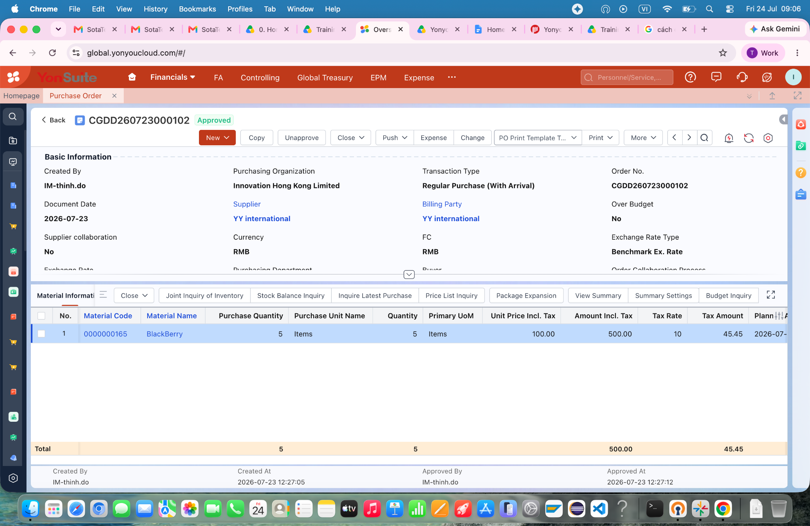
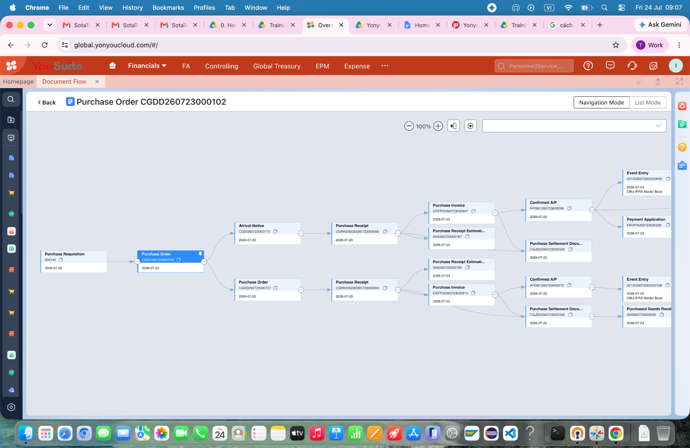
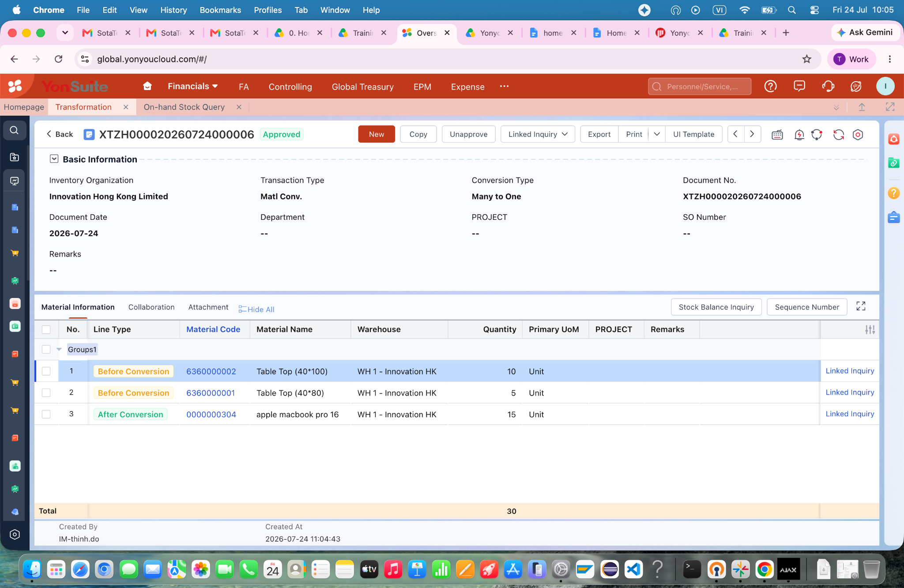
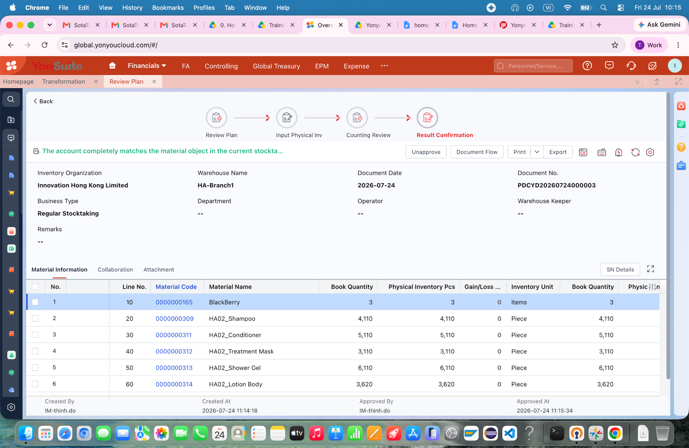
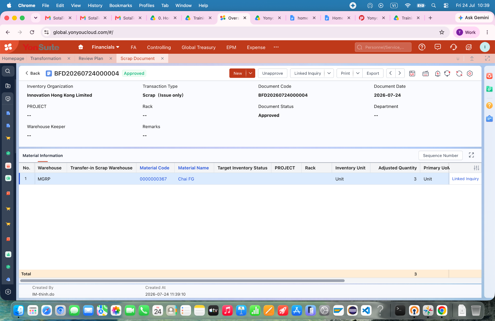
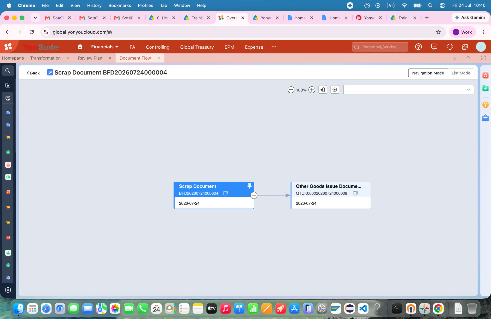
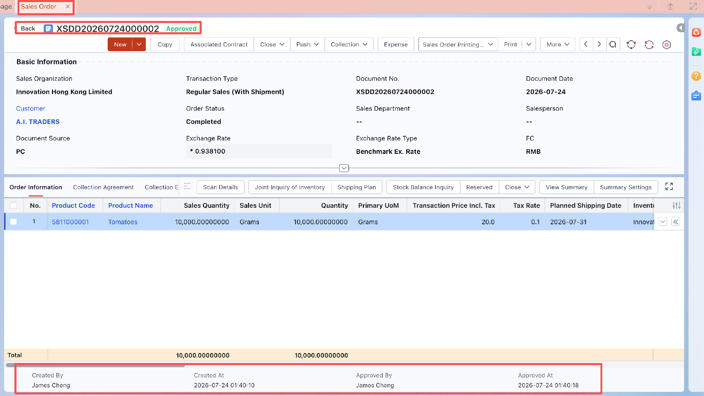
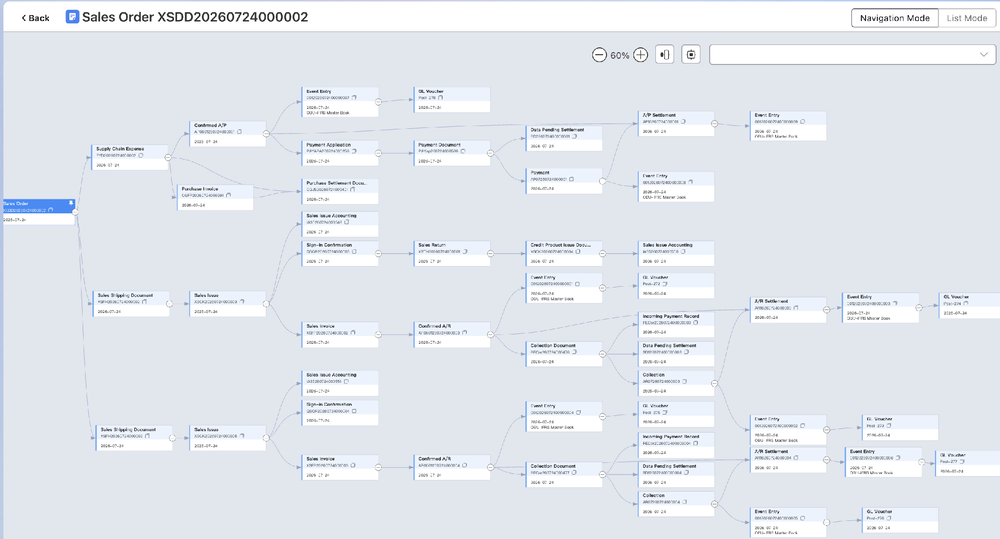

**VietNam\_Do Duc Thinh SCM Homework**

**A. Purchasing Management**

**Homework-PM1:** Raw Material Purchasing(w/o Inspection)

Document Flow 1: Jul 23

Document Flow 2: Jul 23

Document Flow 2: Jul 25

**Homework-PM2:**  Purchasing Return

Document Flow 1: Jul 22

Document Flow 2: Jul 23

Document Flow 2: Jul 24

**Homework-PM3: Purchase Expense**

Document Flow 1: Jul 22

Document Flow 2: Jul 23

Document Flow 2: Jul 24

**Homework-PM4: Optional**

**(master data/ other processes/knowledge you learned of Purchasing Management during this training course. You can max. additional 20 points)**

Document Flow 1: Jul 22

Document Flow 2: Jul 23

Document Flow 2: Jul 24

**B. Inventory Management**

**Homework-IM1: Transformation**

Document Flow 1: Jul 24

Document Flow 2: Jul 24

Document Flow 2: Jul 27

**Homework-IM2: Stocktaking**

Document Flow 1: Jul 23

Document Flow 2: Jul 24

Document Flow 2: Jul 27

**Homework-IM3: Scrap**

Document Flow 1: Jul 23

Document Flow 2: Jul 24

Document Flow 2: Jul 27

**C. Sales Management**

**Homework-SM1: Scenario Solution**

Document Flow 1: Jul 23

Document Flow 2: Jul 24

Document Flow 2: Jul 27