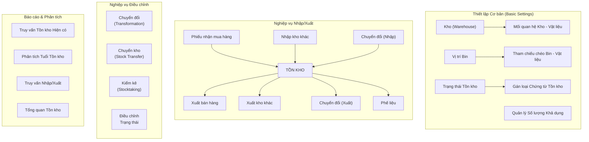
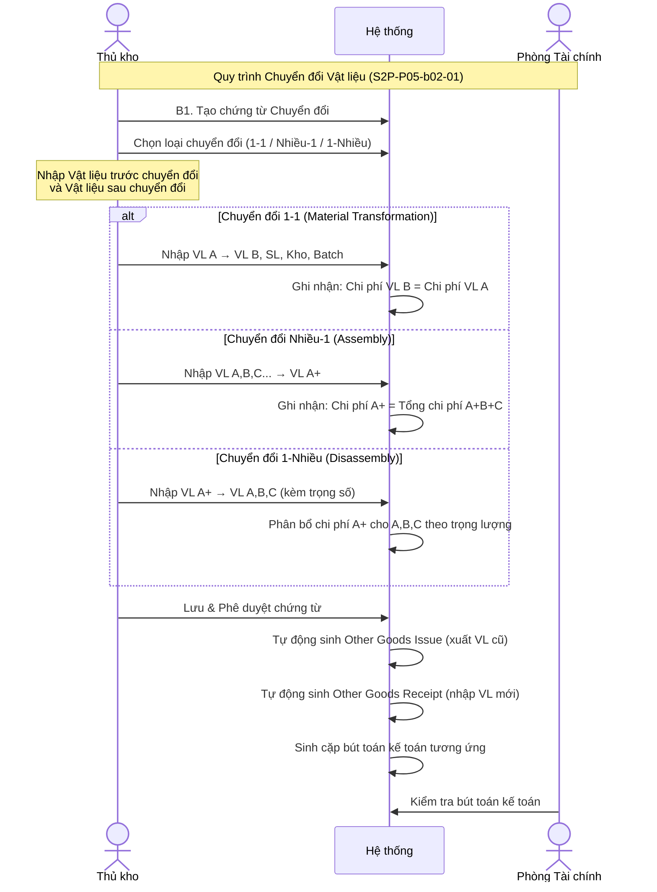
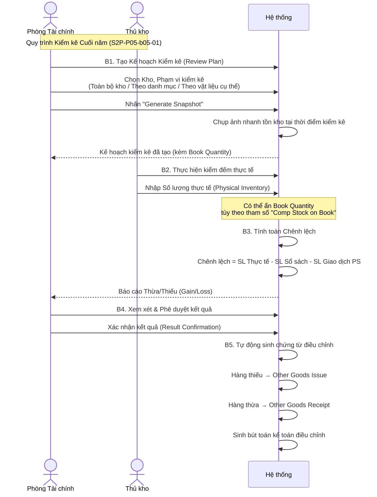

# ĐẶC TẢ NGHIỆP VỤ: QUẢN LÝ TỒN KHO (INVENTORY MANAGEMENT)

> **Mã phân hệ**: SCM-INV
> **Phiên bản**: 1.0.0
> **Ngày cập nhật**: 2026-07-24
> **Tài liệu nguồn**:
> - Slide: YonSuite Partner Implementation Training_SCM_Inventory Mangement_20260723(with Homework).pdf
> - Tài liệu ghi chú: _MConverter.eu_ERP Youyon.md
> - Sơ đồ Mindmap: mindmap1.jpg - mindmap4.jpg

---

## 1. Mục tiêu & Phạm vi nghiệp vụ (Goal & Scope)

Phân hệ Quản lý Tồn kho (Inventory Management) trong YonSuite SCM Cloud cung cấp nền tảng quản lý toàn diện mọi hoạt động biến động kho hàng trong doanh nghiệp. Hệ thống hỗ trợ theo dõi số lượng tồn kho theo thời gian thực, quản lý trạng thái vật liệu, kiểm soát số lượng khả dụng, và tự động hóa các nghiệp vụ điều chỉnh tồn kho.

**Phạm vi bao gồm 7 quy trình nghiệp vụ chính:**
1. Chuyển đổi vật liệu (Transformation) - 3 loại: 1-1, Nhiều-1, 1-Nhiều
2. Xử lý hàng phế liệu (Scrap) - 2 giải pháp
3. Chuyển kho nội bộ (Stock Transfer)
4. Kiểm kê cuối năm (Year-End Stocktaking)
5. Kiểm kê hàng ngày (Daily Inventory Check)
6. Xuất kho khác (Other Goods Issue)
7. Nhập kho khác (Other Goods Receipt)

Ngoài ra còn có các chức năng quản trị: Quản lý trạng thái tồn kho (Inventory Status Control), Quản lý số lượng khả dụng (Available Quantity Management), và Quản lý vị trí lưu trữ (Bin Location Management).

**Đối tượng phục vụ chính:** Doanh nghiệp có hoạt động kho bãi, cần kiểm soát chặt chẽ số lượng, chất lượng, vị trí hàng hóa trong kho.

---

## 2. Đối tượng tham gia (Actors)

| Actor | Mô tả vai trò nghiệp vụ |
| :--- | :--- |
| **Thủ kho (Warehouse Keeper)** | Thực hiện các nghiệp vụ hàng ngày: chuyển đổi vật liệu, chuyển kho, xử lý phế liệu, kiểm kê, nhập/xuất kho khác. Là actor chính cho hầu hết các quy trình. |
| **Quản lý Kho (Warehouse Manager)** | Phê duyệt các chứng từ điều chỉnh tồn kho giá trị lớn, thiết lập kế hoạch kiểm kê cho kiểm kê hàng ngày. |
| **Phòng Tài chính (Finance Dept.)** | Khởi tạo kế hoạch kiểm kê cuối năm, phê duyệt kết quả kiểm kê, xác nhận chênh lệch thừa/thiếu, xử lý giá trị tài chính của các điều chỉnh tồn kho. |
| **Phòng Chất lượng (Quality Dept.)** | Xác nhận hàng hóa không đạt chất lượng để chuyển sang trạng thái phế liệu hoặc đóng băng. |
| **Hệ thống (System)** | Tự động hóa: tính toán số lượng khả dụng, kiểm tra quy tắc xuất/nhập kho, sinh cặp chứng từ xuất/nhập cho chuyển đổi và phế liệu, sinh bút toán kế toán tồn kho, kiểm tra số lượng vượt mức, chụp ảnh nhanh tồn kho khi kiểm kê. |
| **Nhà cung cấp / Khách hàng** | Bên ngoài hệ thống - Liên quan đến các chứng từ nhập mẫu miễn phí (Other Goods Receipt) hoặc gửi mẫu kiểm tra bên thứ ba (Other Goods Issue). |

---

## 3. Sơ đồ Quy trình Nghiệp vụ (Business Workflow)

### 3.1 Tổng quan Kiến trúc Quản lý Tồn kho

### 3.2 Quy trình Chuyển đổi Vật liệu (Transformation)

### 3.3 Quy trình Kiểm kê Cuối năm (Year-End Stocktaking)

---

## 4. Đặc tả chi tiết các bước nghiệp vụ (Business Steps)

### 4.1 Luồng nghiệp vụ chính: Chuyển đổi Vật liệu (Transformation)

| Bước | Actor | Hành động & Chi tiết xử lý | Dữ liệu Đầu vào (Inputs) | Dữ liệu Đầu ra & Trạng thái (Outputs) | Liên kết Rules |
| :--- | :--- | :--- | :--- | :--- | :--- |
| **1** | Thủ kho | **Tạo chứng từ Chuyển đổi:** Truy cập Inventory > Inventory Adjustment > Transformation. Tạo chứng từ mới, chọn loại giao dịch và kiểu chuyển đổi (One-to-One / Many-to-One / One-to-Many). Thêm nhóm (Add Group) cho mỗi cặp chuyển đổi. | - Loại chuyển đổi, Vật liệu trước chuyển đổi (mã, SL, kho, batch), Vật liệu sau chuyển đổi (mã, SL, kho đích, batch mới) | - Chứng từ chuyển đổi đã lưu | `BR-INV-001` |
| **2** | Thủ kho | **Phê duyệt chứng từ:** Sau khi lưu, gửi phê duyệt. Chứng từ được phê duyệt (có thể qua workflow nếu được thiết lập). | - Chứng từ đã lưu | - Chứng từ đã phê duyệt | `BR-INV-002` |
| **3** | Hệ thống | **Tự động sinh chứng từ Xuất kho khác (Other Goods Issue):** Hệ thống tạo chứng từ xuất kho cho (các) vật liệu trước chuyển đổi. | - Chứng từ chuyển đổi đã phê duyệt | - Other Goods Issue đã tạo | `BR-INV-003` |
| **4** | Hệ thống | **Tự động sinh chứng từ Nhập kho khác (Other Goods Receipt):** Hệ thống tạo chứng từ nhập kho cho (các) vật liệu sau chuyển đổi. | - Chứng từ chuyển đổi đã phê duyệt | - Other Goods Receipt đã tạo | `BR-INV-003` |
| **5** | Hệ thống | **Sinh bút toán kế toán:** Hệ thống tự động sinh cặp bút toán kế toán tương ứng cho nghiệp vụ xuất và nhập. | - Other Goods Issue & Receipt | - Bút toán kế toán đã sinh | `BR-INV-004` |

### 4.2 Luồng nghiệp vụ chính: Xử lý Phế liệu (Scrap)

| Bước | Actor | Hành động & Chi tiết xử lý | Dữ liệu Đầu vào (Inputs) | Dữ liệu Đầu ra & Trạng thái (Outputs) | Liên kết Rules |
| :--- | :--- | :--- | :--- | :--- | :--- |
| **1** | Thủ kho | **Tạo chứng từ Phế liệu:** Truy cập Inventory > Inventory Adjustment > Scrap. Tạo mới, chọn tổ chức, chọn vật liệu cần xử lý phế liệu. | - Mã vật liệu, Kho nguồn, SL cần xử lý | - Chứng từ phế liệu đã lưu | `BR-INV-005` |
| **2a** | Thủ kho | **Giải pháp 1 - Chuyển đến kho phế liệu:** Chọn Transaction Type = "Scrap", chọn "Transfer in Scrap Warehouse", chọn kho phế liệu đích. Nhập SL điều chỉnh. Nếu có giá trị thu hồi ước tính, nhập Residue Value. | - Transaction Type = Scrap, Kho phế liệu, SL điều chỉnh, Giá trị thu hồi (nếu có) | - Hệ thống sinh Other Goods Issue (xuất khỏi kho thường) + Other Goods Receipt (nhập vào kho phế liệu) | `BR-INV-006` |
| **2b** | Thủ kho | **Giải pháp 2 - Hủy trực tiếp:** Chọn Transaction Type = "Issue Only". Không chọn kho đích. Nhập SL cần hủy. | - Transaction Type = Issue Only, SL điều chỉnh | - Hệ thống chỉ sinh Other Goods Issue (xuất hủy) | `BR-INV-007` |
| **3** | Hệ thống | **Sinh chứng từ & Kế toán:** Tự động sinh chứng từ xuất/nhập tương ứng và bút toán kế toán. | - Chứng từ phế liệu đã phê duyệt | - Chứng từ xuất/nhập + Bút toán kế toán | `BR-INV-008` |
| **4** | Thủ kho | **(Giải pháp 1) Xử lý thanh lý:** Khi bán phế liệu cho công ty tái chế, sử dụng Inventory Variance Adjustment (nhập số âm) để giảm số lượng trong kho phế liệu. | - SL đã bán (số âm) | - Tồn kho phế liệu giảm | `BR-INV-009` |

### 4.3 Luồng nghiệp vụ chính: Chuyển kho Nội bộ (Stock Transfer)

| Bước | Actor | Hành động & Chi tiết xử lý | Dữ liệu Đầu vào (Inputs) | Dữ liệu Đầu ra & Trạng thái (Outputs) | Liên kết Rules |
| :--- | :--- | :--- | :--- | :--- | :--- |
| **1** | Thủ kho | **Tạo chứng từ Chuyển kho:** Truy cập Inventory > Stock Transfer. Tạo mới, chọn Transaction Type = "Stock Transfer". Chọn kho xuất (Issue Warehouse) và kho nhận (Receipt Warehouse). | - Kho xuất, Kho nhận, Mã vật liệu, SL chuyển | - Chứng từ chuyển kho đã lưu | `BR-INV-010` |
| **2** | Thủ kho | **Phê duyệt chứng từ:** Lưu và phê duyệt chứng từ chuyển kho. | - Chứng từ đã lưu | - Chứng từ đã phê duyệt | `BR-INV-011` |
| **3** | Hệ thống | **Tự động sinh cặp chứng từ:** Hệ thống tự động sinh Goods Issue từ kho xuất và Goods Receipt vào kho nhận. Số lượng, mã vật liệu, batch, chi phí không thay đổi - chỉ thay đổi vị trí. | - Chứng từ chuyển kho đã phê duyệt | - Goods Issue + Goods Receipt | `BR-INV-012` |

### 4.4 Luồng nghiệp vụ chính: Kiểm kê Cuối năm (Year-End Stocktaking)

| Bước | Actor | Hành động & Chi tiết xử lý | Dữ liệu Đầu vào (Inputs) | Dữ liệu Đầu ra & Trạng thái (Outputs) | Liên kết Rules |
| :--- | :--- | :--- | :--- | :--- | :--- |
| **1** | Phòng TC | **Lập Kế hoạch Kiểm kê:** Truy cập Stock Taking > Closing Stock Taking. Tạo Review Plan mới, chọn kho, phạm vi kiểm kê (toàn bộ kho / danh mục / vật liệu cụ thể). Nhấn "Generate Snapshot" để hệ thống ghi nhận số lượng tồn kho hiện tại. | - Kho, Phạm vi kiểm kê, Loại giao dịch | - Kế hoạch kiểm kê + Book Quantity (ảnh chụp nhanh) | `BR-INV-013`, `BR-INV-014` |
| **2** | Thủ kho | **Nhập Số lượng Thực tế:** Truy cập Input Physical Inventories. Thực hiện kiểm đếm thực tế và nhập số lượng tìm thấy cho từng vật liệu. | - SL thực tế cho từng vật liệu | - Physical Inventory Document | `BR-INV-015` |
| **3** | Hệ thống | **Tính toán Chênh lệch:** Hệ thống tự động tính: Chênh lệch = SL Thực tế - SL Sổ sách - SL Giao dịch phát sinh (nếu có cấu hình tính toán). | - SL Thực tế, SL Sổ sách, SL Giao dịch PS | - Báo cáo Thừa/Thiếu (Gain/Loss) | `BR-INV-016`, `BR-INV-017` |
| **4** | Phòng TC | **Xác nhận Kết quả:** Xem xét Counting Review, sau đó thực hiện Result Confirmation. Phê duyệt kết quả kiểm kê. | - Báo cáo chênh lệch | - Kết quả kiểm kê đã xác nhận | `BR-INV-018` |
| **5** | Hệ thống | **Tự động sinh chứng từ điều chỉnh:** Với hàng thừa (Gain) → Other Goods Receipt. Với hàng thiếu (Loss) → Other Goods Issue. | - Kết quả đã xác nhận | - Chứng từ điều chỉnh + Bút toán kế toán | `BR-INV-019` |

### 4.5 Luồng nghiệp vụ: Kiểm kê Hàng ngày (Daily Inventory Check)

| Bước | Actor | Hành động & Chi tiết xử lý | Dữ liệu Đầu vào (Inputs) | Dữ liệu Đầu ra & Trạng thái (Outputs) | Liên kết Rules |
| :--- | :--- | :--- | :--- | :--- | :--- |
| **1** | Thủ kho / QL Kho | **Tạo chứng từ Kiểm kê Hàng ngày:** Truy cập Stock Taking > Daily Stock Taking. Tạo mới trực tiếp (không cần kế hoạch). Chọn vật liệu cần kiểm kê. | - Vật liệu kiểm kê | - Chứng từ kiểm kê hàng ngày | `BR-INV-020` |
| **2** | Thủ kho | **Nhập SL thực tế:** Nhập số lượng kiểm đếm thực tế. | - SL thực tế | - Physical Inventory Document | - |
| **3** | Hệ thống | **Tính chênh lệch & Phê duyệt:** Hệ thống tính chênh lệch và sinh Counting Review. Người dùng xác nhận kết quả. | - SL thực tế vs SL sổ sách | - Chênh lệch Thừa/Thiếu | `BR-INV-016` |
| **4** | Hệ thống | **Sinh chứng từ điều chỉnh:** Tương tự kiểm kê cuối năm: hàng thừa → Other Goods Receipt, hàng thiếu → Other Goods Issue. | - Kết quả đã xác nhận | - Chứng từ điều chỉnh | `BR-INV-019` |

### 4.6 Luồng nghiệp vụ: Nhập/Xuất kho khác (Other Goods Issue/Receipt)

| Bước | Actor | Hành động & Chi tiết xử lý | Dữ liệu Đầu vào (Inputs) | Dữ liệu Đầu ra & Trạng thái (Outputs) | Liên kết Rules |
| :--- | :--- | :--- | :--- | :--- | :--- |
| **1** | Thủ kho | **Nhập kho khác:** Truy cập Inv Receipt/Issue > Other Goods Receipt. Tạo mới, chọn loại giao dịch, chọn kho, nhập vật liệu và số lượng nhận. Sử dụng cho: nhận hàng mẫu miễn phí từ NCC, điều chỉnh tăng sau kiểm kê. | - Loại GD, Kho, Mã vật liệu, SL | - Other Goods Receipt đã lưu | `BR-INV-021` |
| **1'** | Thủ kho | **Xuất kho khác:** Truy cập Inv Receipt/Issue > Other Goods Issue. Tạo mới, chọn loại giao dịch, chọn kho, nhập vật liệu và số lượng xuất. Sử dụng cho: gửi mẫu kiểm tra bên thứ ba, điều chỉnh giảm sau kiểm kê. | - Loại GD, Kho, Mã vật liệu, SL | - Other Goods Issue đã lưu | `BR-INV-021` |
| **2** | Hệ thống | **Sinh bút toán kế toán:** Tự động sinh bút toán kế toán điều chỉnh tương ứng. | - Chứng từ đã phê duyệt | - Bút toán kế toán | `BR-INV-022` |

---

## 5. Đặc tả thông tin nghiệp vụ (Information Schema)

### 5.1 Thực thể: Chứng từ Chuyển đổi (Transformation Document)

| # | Tên trường | Kiểu dữ liệu | Bắt buộc | Quy tắc xác thực & Ràng buộc nghiệp vụ |
| :--- | :--- | :--- | :--- | :--- |
| 1 | Mã chứng từ | Text/Mã | Y | Tự động sinh |
| 2 | Loại giao dịch | Danh mục | Y | Theo thiết lập Transaction Type |
| 3 | Kiểu chuyển đổi (Conversion Type) | Danh mục | Y | One-to-One / Many-to-One / One-to-Many |
| 4 | Đơn vị kinh doanh | Danh mục | Y | Phải là Inventory Organization |
| 5 | Nhóm chuyển đổi | Bảng con | Y | Mỗi nhóm = 1 cặp Trước/Sau chuyển đổi |
| 6 | VL trước chuyển đổi - Mã | Danh mục | Y | VL hiện có trong kho |
| 7 | VL trước chuyển đổi - SL | Số thực | Y | > 0, ≤ SL tồn kho khả dụng |
| 8 | VL trước chuyển đổi - Kho | Danh mục | Y | Kho xuất |
| 9 | VL trước chuyển đổi - Batch | Text | N | Nếu VL có Batch Management |
| 10 | VL sau chuyển đổi - Mã | Danh mục | Y | VL đích |
| 11 | VL sau chuyển đổi - SL | Số thực | Y | > 0 |
| 12 | VL sau chuyển đổi - Kho | Danh mục | Y | Có thể khác kho xuất |
| 13 | VL sau chuyển đổi - Batch mới | Text | N | Batch mới nếu cần |
| 14 | Trọng số phân bổ (1-Nhiều) | Số thực | N | Chỉ dùng cho One-to-Many, để phân bổ chi phí |
| 15 | Trạng thái | Danh mục | Y | Đã lưu → Đã phê duyệt → Đã xử lý |

### 5.2 Thực thể: Chứng từ Phế liệu (Scrap Document)

| # | Tên trường | Kiểu dữ liệu | Bắt buộc | Quy tắc xác thực & Ràng buộc nghiệp vụ |
| :--- | :--- | :--- | :--- | :--- |
| 1 | Mã chứng từ | Text/Mã | Y | Tự động sinh |
| 2 | Loại giao dịch | Danh mục | Y | "Scrap" (chuyển kho phế liệu) hoặc "Issue Only" (hủy trực tiếp) |
| 3 | Đơn vị kinh doanh | Danh mục | Y | Inventory Organization |
| 4 | Kho nguồn | Danh mục | Y | Kho chứa VL cần xử lý |
| 5 | Kho phế liệu đích | Danh mục | N | Chỉ dùng nếu Transaction Type = Scrap |
| 6 | Mã vật liệu | Danh mục | Y | VL cần xử lý phế liệu |
| 7 | Trạng thái tồn kho nguồn | Danh mục | Y | Mặc định: Qualified |
| 8 | Trạng thái tồn kho đích | Danh mục | N | Tự động: Scrap |
| 9 | Số lượng điều chỉnh | Số thực | Y | > 0 |
| 10 | Giá trị thu hồi (Residue Value) | Tiền tệ | N | Giá trị ước tính còn lại của phế liệu |
| 11 | Đơn giá phế liệu | Tiền tệ | N | Để tính giá vốn |
| 12 | Tổng giá trị phế liệu | Tiền tệ | Y | Tự động tính: SL × Đơn giá |
| 13 | Trạng thái | Danh mục | Y | Đã lưu → Đã phê duyệt → Đã xử lý |

### 5.3 Thực thể: Kế hoạch Kiểm kê (Stocktaking Review Plan)

| # | Tên trường | Kiểu dữ liệu | Bắt buộc | Quy tắc xác thực & Ràng buộc nghiệp vụ |
| :--- | :--- | :--- | :--- | :--- |
| 1 | Mã kế hoạch | Text/Mã | Y | Tự động sinh |
| 2 | Loại giao dịch | Danh mục | Y | Regular Stocktaking |
| 3 | Kho kiểm kê | Danh mục | Y | Kho cần kiểm kê |
| 4 | Phạm vi kiểm kê | Danh mục | Y | Toàn bộ kho / Theo danh mục / Theo vật liệu cụ thể |
| 5 | Danh mục/Vật liệu cụ thể | Danh mục | N | Nếu chọn phạm vi hẹp |
| 6 | Ngày kiểm kê | Ngày | Y | Ngày thực hiện |
| 7 | Số lượng sổ sách (Book Qty) | Số thực | Y | Tự động từ Snapshot |
| 8 | Số lượng thực tế (Physical Qty) | Số thực | Y | Nhập sau khi kiểm đếm |
| 9 | Số lượng giao dịch PS | Số thực | N | Tính tự động nếu cấu hình |
| 10 | Chênh lệch thừa (Gain Qty) | Số thực | Y | Tự động tính |
| 11 | Chênh lệch thiếu (Loss Qty) | Số thực | Y | Tự động tính |
| 12 | Trạng thái | Danh mục | Y | Kế hoạch → Đã kiểm đếm → Đã xem xét → Đã xác nhận |

### 5.4 Thực thể: Cấu hình Kho (Warehouse)

| # | Tên trường | Kiểu dữ liệu | Bắt buộc | Quy tắc xác thực & Ràng buộc nghiệp vụ |
| :--- | :--- | :--- | :--- | :--- |
| 1 | Mã kho | Text/Mã | Y | Định danh duy nhất |
| 2 | Tên kho | Text | Y | - |
| 3 | Tổ chức quản lý kho | Danh mục | Y | Inventory Organization |
| 4 | Tham gia tính SL khả dụng | Boolean | Y | Yes/No |
| 5 | Tính giá vốn (Calculate Cost) | Boolean | Y | Nếu Yes → phải cấu hình Cost Area |
| 6 | Quản lý Bin (Storage Bin Mgmt) | Boolean | N | Yes/No - phải chọn Yes nếu cần quản lý vị trí |
| 7 | Quản lý Serial | Boolean | N | Yes/No |
| 8 | Quản lý kho cho Subcontracting | Boolean | N | Yes/No |

### 5.5 Thực thể: Trạng thái Tồn kho (Inventory Status)

| # | Tên trường | Kiểu dữ liệu | Bắt buộc | Quy tắc xác thực & Ràng buộc nghiệp vụ |
| :--- | :--- | :--- | :--- | :--- |
| 1 | Mã trạng thái | Text/Mã | Y | Định danh duy nhất |
| 2 | Tên trạng thái | Text | Y | Qualified / Pending Inspection / Frozen / Unqualified / Scrap / In Transit |
| 3 | Khả dụng (Available) | Boolean | Y | Yes nếu hàng ở trạng thái này được tính vào SL khả dụng |
| 4 | Cho phép trong GD Nhập | Boolean | N | Cấu hình theo loại chứng từ (Inventory Document Type) |
| 5 | Cho phép trong GD Xuất | Boolean | N | Cấu hình theo loại chứng từ |

---

## 6. Điểm tích hợp hệ thống (Integration Points)

### 6.1 Các tích hợp hiện có

| Tên hệ thống liên kết | Mục đích tích hợp | Giao thức/Phương thức | Chiều dữ liệu & Nội dung chính |
| :--- | :--- | :--- | :--- |
| **Purchase Management** | Nhận phiếu nhận mua hàng (Purchase Receipt) để cập nhật tồn kho đầu vào | Nội bộ YonSuite (Sync/Realtime) | **Nhận:** Purchase Receipt → Cập nhật tồn kho tăng **Gửi:** SL khả dụng cho kiểm tra khi tạo PR/PO |
| **Sales Management** | Xuất hàng bán (Sales Outbound) làm giảm tồn kho | Nội bộ YonSuite (Sync/Realtime) | **Nhận:** Sales Shipping Document → Giảm tồn kho **Gửi:** SL khả dụng cho kiểm tra khi tạo Sales Order |
| **Finance Cloud (Inventory Accounting)** | Hạch toán kế toán tồn kho cho mọi biến động: nhập, xuất, chuyển đổi, phế liệu, kiểm kê | Nội bộ YonSuite (Sync/Realtime) | **Gửi:** Mọi chứng từ nhập/xuất kho **Nhận:** Bút toán kế toán tồn kho, Giá vốn |
| **Finance Cloud (GL)** | Hạch toán kế toán tổng hợp cho các nghiệp vụ điều chỉnh tồn kho | Nội bộ YonSuite (Sync/Realtime) | **Gửi:** Chứng từ điều chỉnh (Transformation, Scrap, Stocktaking) **Nhận:** Bút toán GL |
| **Manufacturing Cloud (Quality Control)** | Nhận kết quả kiểm tra chất lượng để cập nhật trạng thái tồn kho (Qualified / Unqualified) | Nội bộ YonSuite (Sync/Realtime) | **Nhận:** Kết quả kiểm tra → Cập nhật Inventory Status |
| **Digital Modeling (Workflow)** | Kích hoạt luồng phê duyệt cho các chứng từ điều chỉnh tồn kho | Nội bộ YonSuite (Sync/Realtime) | **Gửi:** Chứng từ cần phê duyệt **Nhận:** Kết quả phê duyệt |
| **Inventory Planning (Giai đoạn 2)** | Sử dụng dữ liệu Safety Stock, Max Stock, Min Stock, Reorder Point để lập kế hoạch tồn kho | Nội bộ YonSuite (Sync/Batch) | **Gửi:** SL tồn kho, Cấu hình mức tồn **Nhận:** Đề xuất đặt hàng |

### 6.2 Các tích hợp đề xuất (Recommendations)

- **Hệ thống Mã vạch / QR Code (Barcode Scanner)**: Tích hợp thiết bị quét mã vạch để tự động nhận diện vật liệu, batch, bin location khi thực hiện nhập/xuất kho và kiểm kê. Giảm sai sót nhập liệu thủ công và tăng tốc độ thao tác.
- **Hệ thống RFID**: Đối với kho hàng lớn, tự động hóa việc kiểm kê và theo dõi vị trí hàng hóa theo thời gian thực bằng công nghệ RFID.
- **Hệ thống WMS (Warehouse Management System)**: Đối với doanh nghiệp có kho hàng phức tạp, tích hợp WMS chuyên dụng để quản lý picking, packing, putaway, slotting nâng cao.
- **Hệ thống IoT Cảm biến Môi trường**: Đối với kho lạnh, kho thực phẩm, kho dược phẩm - tích hợp cảm biến nhiệt độ, độ ẩm để cảnh báo khi điều kiện bảo quản vượt ngưỡng, tự động chuyển trạng thái tồn kho sang "Frozen" hoặc "Unqualified".
- **Hệ thống EDI (Electronic Data Interchange)**: Trao đổi dữ liệu tồn kho điện tử với nhà cung cấp và khách hàng lớn để tự động cập nhật tình trạng hàng hóa.

---

## 7. Quy tắc nghiệp vụ (Business Rules - BR)

| Mã Rule | Tên Quy tắc | Mô tả chi tiết quy tắc nghiệp vụ | Nguồn tham chiếu |
| :--- | :--- | :--- | :--- |
| **BR-INV-001** | Ba kiểu chuyển đổi vật liệu | (a) One-to-One: VL A → VL B, chi phí B = chi phí A. (b) Many-to-One (Assembly): VL A,B,C... → VL A+, chi phí A+ = Σ(A,B,C). (c) One-to-Many (Disassembly): VL A+ → A,B,C..., chi phí phân bổ theo trọng lượng. Có thể thay đổi số lượng, kho, batch trong quá trình chuyển đổi. | Slide Inventory Mgt p.39, ERP Notes |
| **BR-INV-002** | Chứng từ chuyển đổi không cần workflow phức tạp | Chứng từ Transformation có quy trình đơn giản: tạo → lưu → phê duyệt. Tuy nhiên vẫn có thể cấu hình workflow nếu khách hàng yêu cầu. | ERP Notes |
| **BR-INV-003** | Tự động sinh cặp chứng từ xuất/nhập | Khi Transformation được phê duyệt, hệ thống tự động tạo đồng thời Other Goods Issue (xuất VL cũ) và Other Goods Receipt (nhập VL mới). Người dùng không cần tạo thủ công. | Slide p.39, ERP Notes |
| **BR-INV-004** | Kế toán chuyển đổi | Hệ thống tự động sinh cặp bút toán kế toán: một bút toán xuất và một bút toán nhập tương ứng với giá trị hàng chuyển đổi. | ERP Notes |
| **BR-INV-005** | Hai giải pháp xử lý phế liệu | Giải pháp 1: Chuyển hàng phế liệu sang kho phế liệu riêng → xử lý thanh lý sau. Giải pháp 2: Hủy trực tiếp (chỉ xuất kho, không nhập kho phế liệu). Lựa chọn dựa trên nhu cầu quản lý của khách hàng. | Slide p.6, ERP Notes |
| **BR-INV-006** | Giải pháp 1 - Chuyển kho phế liệu | Transaction Type = "Scrap", chọn Transfer in Scrap Warehouse. Hệ thống sinh Other Goods Issue (xuất khỏi kho thường) + Other Goods Receipt (nhập kho phế liệu). Có thể nhập Residue Value nếu phế liệu còn giá trị thu hồi. | ERP Notes |
| **BR-INV-007** | Giải pháp 2 - Hủy trực tiếp | Transaction Type = "Issue Only". Hệ thống chỉ sinh Other Goods Issue (xuất hủy trực tiếp). Không có bước chuyển kho phế liệu. Phù hợp khi không cần theo dõi phế liệu tồn. | ERP Notes |
| **BR-INV-008** | Kế toán phế liệu | Hệ thống tự động sinh bút toán kế toán tương ứng: xuất kho giảm giá trị tồn kho, ghi nhận chi phí phế liệu. | ERP Notes |
| **BR-INV-009** | Thanh lý phế liệu khỏi kho phế liệu | Khi bán phế liệu cho công ty tái chế, sử dụng Inventory Variance Adjustment với số âm để giảm số lượng trong kho phế liệu. Đây là một dạng Stocktaking Loss. | ERP Notes |
| **BR-INV-010** | Điều kiện chuyển kho | Chỉ áp dụng trong cùng một doanh nghiệp, giữa các kho khác nhau. Số hiệu vật liệu, batch, chi phí không thay đổi - chỉ thay đổi vị trí lưu trữ. | ERP Notes |
| **BR-INV-011** | Chứng từ chuyển kho | Chọn Transaction Type = "Stock Transfer". Chọn kho xuất (Issue Warehouse) và kho nhận (Receipt Warehouse). Không giới hạn số lượng dòng trên một chứng từ. | Slide, ERP Notes |
| **BR-INV-012** | Tự động sinh cặp chứng từ chuyển kho | Sau khi phê duyệt, hệ thống tự động sinh Goods Issue từ kho xuất và Goods Receipt vào kho nhận với cùng số lượng. | ERP Notes |
| **BR-INV-013** | Ảnh chụp nhanh tồn kho (Snapshot) | Khi tạo kế hoạch kiểm kê, nhấn "Generate Snapshot" để hệ thống ghi nhận tức thời số lượng tồn kho tại thời điểm bắt đầu kiểm kê. Đây là dữ liệu cơ sở (Book Quantity) để đối chiếu. | Slide p.36 |
| **BR-INV-014** | Phạm vi kiểm kê linh hoạt | Hỗ trợ 3 phạm vi: (a) Toàn bộ kho (Whole Warehouse), (b) Theo danh mục vật liệu (Specified Category), (c) Theo vật liệu cụ thể (Specified Materials). | ERP Notes |
| **BR-INV-015** | Hiển thị/Ẩn Book Quantity khi kiểm kê | Tham số "Comp Stock on Book": Nếu Yes → Thủ kho thấy được số lượng sổ sách khi nhập số liệu kiểm kê. Nếu No → Thủ kho không thấy số lượng sổ sách, chỉ nhập số đếm thực tế. Đây là điểm kiểm soát quan trọng. | Slide p.35, ERP Notes |
| **BR-INV-016** | Công thức tính chênh lệch kiểm kê | Chênh lệch = Số lượng Thực tế - Số lượng Sổ sách - Số lượng Giao dịch Phát sinh (nếu có cấu hình "Calculate Business Occur during Stock Taking" = Yes). Nếu = No, hệ thống giả định không có giao dịch phát sinh trong thời gian kiểm kê. | Slide p.35, ERP Notes |
| **BR-INV-017** | Đóng băng giao dịch khi kiểm kê | Nếu tham số "Calculate Business Occur during Stock Taking" = No, mọi giao dịch nhập/xuất kho phải tạm dừng trong thời gian kiểm kê (đóng băng). Nếu = Yes, giao dịch vẫn tiếp tục và hệ thống tự tính toán bù trừ. | ERP Notes |
| **BR-INV-018** | Phê duyệt kết quả kiểm kê | Kết quả kiểm kê phải được Phòng Tài chính phê duyệt (Result Confirmation) trước khi hệ thống sinh chứng từ điều chỉnh. | ERP Notes |
| **BR-INV-019** | Tự động sinh chứng từ điều chỉnh kiểm kê | Hàng thừa (Gain) → Hệ thống tự động sinh Other Goods Receipt. Hàng thiếu (Loss) → Hệ thống tự động sinh Other Goods Issue. | Slide, ERP Notes |
| **BR-INV-020** | Khác biệt kiểm kê hàng ngày và cuối năm | Kiểm kê cuối năm: Phòng TC tạo kế hoạch → Thủ kho kiểm đếm → Phòng TC phê duyệt. Kiểm kê hàng ngày: Không cần kế hoạch, Thủ kho tự tạo chứng từ trực tiếp. Nếu khách hàng vẫn muốn có kế hoạch cho kiểm kê hàng ngày, có thể dùng Closing Stock Taking với kế hoạch do bộ phận kho tự tạo. | ERP Notes |
| **BR-INV-021** | Nhập/Xuất kho khác | Sử dụng cho các trường hợp không thuộc quy trình chuẩn: nhận hàng mẫu miễn phí từ NCC (Other Goods Receipt), gửi mẫu đi kiểm tra bên thứ ba (Other Goods Issue), điều chỉnh chênh lệch sau kiểm kê. | ERP Notes |
| **BR-INV-022** | Kế toán nhập/xuất kho khác | Hệ thống tự động sinh bút toán kế toán tương ứng cho mỗi chứng từ Other Goods Issue/Receipt đã phê duyệt. | ERP Notes |

### 7.1 Quy tắc về Số lượng Khả dụng (Available Quantity Rules)

| Mã Rule | Tên Quy tắc | Mô tả chi tiết quy tắc nghiệp vụ | Nguồn tham chiếu |
| :--- | :--- | :--- | :--- |
| **BR-INV-030** | Công thức số lượng khả dụng | Số lượng Khả dụng = Tồn kho Hiện có (On-hand) - Số lượng Xuất Dự kiến (Anticipated Issue) + Số lượng Nhập Dự kiến (Anticipated Receipt). | Slide p.29-31 |
| **BR-INV-031** | Cấu hình Thành phần SL Khả dụng | Có thể tùy chỉnh loại chứng từ nào được tính vào Anticipated Receipt (PR, PO, Subcontract Order, Transfer Order...) và Anticipated Issue (Sales Order, Manufacturing Order...). Mỗi khách hàng có thể có quy tắc khác nhau. | Slide p.29 |
| **BR-INV-032** | Quy tắc Kiểm tra SL Khả dụng | Cấu hình cho từng loại chứng từ: (a) Strict Control - không cho phép lưu nếu không đủ SL khả dụng, (b) Do Not Check - bỏ qua kiểm tra. Thời điểm kiểm tra có thể là khi Lưu (Save) hoặc khi Phê duyệt. | Slide p.31 |
| **BR-INV-033** | Phân bổ Quy tắc Kiểm tra | Quy tắc kiểm tra SL khả dụng được phân bổ cho từng Đơn vị kinh doanh (Organization). Mỗi đơn vị có thể áp dụng quy tắc khác nhau. | Slide p.32 |

### 7.2 Quy tắc về Quan hệ Kho - Vật liệu

| Mã Rule | Tên Quy tắc | Mô tả chi tiết quy tắc nghiệp vụ | Nguồn tham chiếu |
| :--- | :--- | :--- | :--- |
| **BR-INV-040** | Thiết lập quan hệ Kho - Vật liệu | Có thể định nghĩa vật liệu nào được phép nhập/xuất tại kho nào. 3 mức kiểm soát: (a) Do Not Check - không kiểm tra, (b) Prompt - cảnh báo nhưng vẫn cho phép, (c) Strict Control - chặn giao dịch nếu sai kho. | Slide p.25, ERP Notes |
| **BR-INV-041** | Kiểm soát Bin - Vật liệu | Có thể định nghĩa mối quan hệ giữa vị trí Bin và vật liệu với mức độ ưu tiên khác nhau. Bin Management không phải là quy trình bắt buộc. | Slide p.13 |

### 7.3 Quy tắc về Tham số Tồn kho

| Mã Rule | Tên Quy tắc | Mô tả chi tiết quy tắc nghiệp vụ | Nguồn tham chiếu |
| :--- | :--- | :--- | :--- |
| **BR-INV-050** | Kiểm soát xuất vượt mức (Over-Issuing) | Tham số "Allow Issue Quantity Exceed Issue Application Quantity": Nếu Yes, SL xuất tối đa = SL yêu cầu × (1 + Tỷ lệ cho phép vượt từ Sealing of Over-Issuing trên Master Data). VD: Tỷ lệ 15%, yêu cầu 100 → xuất tối đa 115. Phù hợp với ngành thép, vật liệu không kiểm soát chính xác được trọng lượng. | Slide p.33 |
| **BR-INV-051** | Phương thức Nhập/Xuất 1 bước vs 2 bước | One-step: Lưu và phê duyệt → cập nhật tồn kho ngay + kích hoạt kế toán. Two-step: Bước 1 (Lưu) → chưa cập nhật tồn kho, Bước 2 (Xác nhận bởi người thứ 2) → cập nhật tồn kho + kế toán. Phù hợp cho doanh nghiệp cần kiểm tra kép. | Slide p.34 |

---

## 8. Đề xuất & Lưu ý thiết kế (Recommendations & Design Considerations)

| Mã Rec | Phân loại | Nội dung đề xuất / Lưu ý thiết kế | Lợi ích mang lại |
| :--- | :--- | :--- | :--- |
| **REC-INV-001** | UX | Trên màn hình Chuyển đổi (Transformation), hiển thị tồn kho khả dụng của vật liệu nguồn ngay khi chọn để thủ kho biết có đủ số lượng để chuyển đổi không. | Giảm thao tác tra cứu, tránh tạo chứng từ không khả thi. |
| **REC-INV-002** | UX | Khi chọn "Issue Only" cho phế liệu, hiển thị cảnh báo xác nhận: "Hành động này sẽ hủy vĩnh viễn [SL] [Đơn vị] của [Vật liệu]. Bạn có chắc chắn?" | Ngăn ngừa sai sót nghiêm trọng. |
| **REC-INV-003** | Tối ưu | Tự động đề xuất kiểm kê cho các vật liệu có chênh lệch bất thường giữa sổ sách và thực tế dựa trên lịch sử giao dịch. | Tập trung nguồn lực kiểm kê vào các mặt hàng rủi ro cao. |
| **REC-INV-004** | Kỹ thuật | Sử dụng cơ chế batch job để tự động tính toán và cập nhật SL khả dụng định kỳ thay vì tính toán realtime cho mọi truy vấn (có thể cấu hình theo nhu cầu). | Tối ưu hiệu năng hệ thống với kho dữ liệu lớn. |
| **REC-INV-005** | Tối ưu | Thiết lập cảnh báo tự động khi tồn kho xuống dưới mức Safety Stock hoặc Reorder Point (đã cấu hình trên Master Data). Gửi thông báo cho bộ phận mua hàng. | Chủ động phòng ngừa thiếu hụt nguyên vật liệu. |
| **REC-INV-006** | Kỹ thuật | Thiết lập index cho bảng Inventory Ledger trên các trường: Material Code, Warehouse, Batch Number, Transaction Date để tối ưu các báo cáo Stock Aging và Inventory Outlook. | Tăng tốc độ báo cáo phân tích. |
| **REC-INV-007** | UX | Cung cấp màn hình "Inventory Workbench" tổng hợp: hiển thị đồng thời On-hand Stock, Available Quantity, Anticipated Receipts, Anticipated Issues cho một vật liệu hoặc kho được chọn. | Cái nhìn toàn diện, quyết định nhanh. |
| **REC-INV-008** | Tối ưu | Tự động hóa kiểm kê chu kỳ (Cycle Counting): Hệ thống tự động lên lịch kiểm kê cho các nhóm vật liệu theo tần suất định trước (VD: Nhóm A mỗi tháng, Nhóm B mỗi quý, Nhóm C mỗi năm). | Duy trì độ chính xác tồn kho liên tục, không cần kiểm kê toàn bộ cuối năm. |
| **REC-INV-009** | UX | Hỗ trợ nhập liệu kiểm kê qua mobile app/tablet để thủ kho có thể vừa kiểm đếm vừa nhập liệu trực tiếp tại vị trí hàng hóa. | Tăng tốc kiểm kê, giảm sai sót do ghi chép rồi nhập lại. |
| **REC-INV-010** | Kỹ thuật | Cấu hình cảnh báo hết hạn (Expiry Date Alert) cho vật liệu có quản lý hạn sử dụng (Batch Management + Validity Period). Tự động chuyển trạng thái sang "Frozen" khi cận hạn. | Tuân thủ quy định an toàn, giảm lãng phí. |

---

## 9. Câu hỏi cần làm rõ (Open Questions)

- **[OQ-INV-001]**: Khi thực hiện chuyển đổi One-to-Many (Disassembly), chi phí được phân bổ theo trọng lượng. Nếu vật liệu không có thông tin trọng lượng, hệ thống phân bổ theo tiêu chí nào khác? Có hỗ trợ phân bổ theo tỷ lệ phần trăm do người dùng tự nhập không?
- **[OQ-INV-002]**: Trong quy trình kiểm kê, khi tham số "Calculate Business Occur during Stock Taking" = Yes, hệ thống tính toán giao dịch phát sinh như thế nào khi có nhiều giao dịch đồng thời? Có cần khóa vật liệu đang kiểm kê không?
- **[OQ-INV-003]**: Kho phế liệu (Scrap Warehouse) có được tham gia vào tính toán số lượng khả dụng không? Có cần cấu hình Cost Area riêng cho kho phế liệu không?
- **[OQ-INV-004]**: Khi chuyển kho nội bộ giữa 2 kho có Cost Area khác nhau, giá vốn hàng chuyển đi có được tính lại theo Cost Area của kho nhận không?
- **[OQ-INV-005]**: Có hỗ trợ quy trình mượn/cho mượn hàng giữa các kho hoặc giữa các đơn vị kinh doanh không (Borrow & Lend)? Nếu có, quy trình này được xử lý như thế nào?
- **[OQ-INV-006]**: Đối với quản lý bin location, hệ thống có hỗ trợ tự động đề xuất vị trí bin tối ưu khi nhập hàng dựa trên đặc tính vật liệu (nặng/nhẹ, tần suất xuất cao/thấp) không?
- **[OQ-INV-007]**: Trong kiểm kê cuối năm, nếu phát hiện chênh lệch lớn vượt ngưỡng cho phép, hệ thống có tự động kích hoạt workflow phê duyệt bổ sung không (ví dụ: cần Giám đốc phê duyệt nếu chênh lệch > X%)?
- **[OQ-INV-008]**: Các giao dịch Inventory Adjustment (Transformation, Scrap, Stock Transfer) có bị giới hạn bởi phân quyền theo kho không? VD: Thủ kho A chỉ được thao tác trên Kho A?

---

## 10. Nhật ký thay đổi (Revision History)

| Phiên bản | Ngày cập nhật | Người thực hiện | Nội dung thay đổi |
| :--- | :--- | :--- | :--- |
| **1.0.0** | 2026-07-24 | AI Agent | Khởi tạo tài liệu đặc tả nghiệp vụ Quản lý Tồn kho (SCM-INV) từ Slide đào tạo, tài liệu ghi chú ERP và sơ đồ Mindmap. Bao gồm 7 quy trình, 3 nhóm Business Rules (22 BR), 10 Recommendations. |
