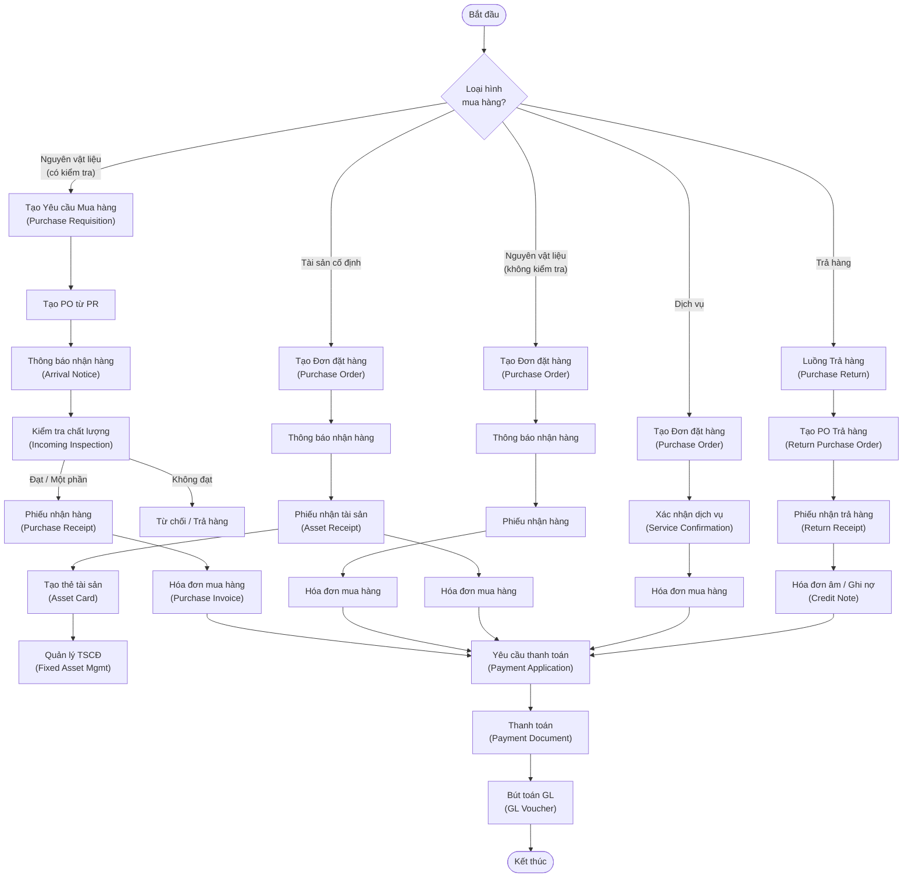
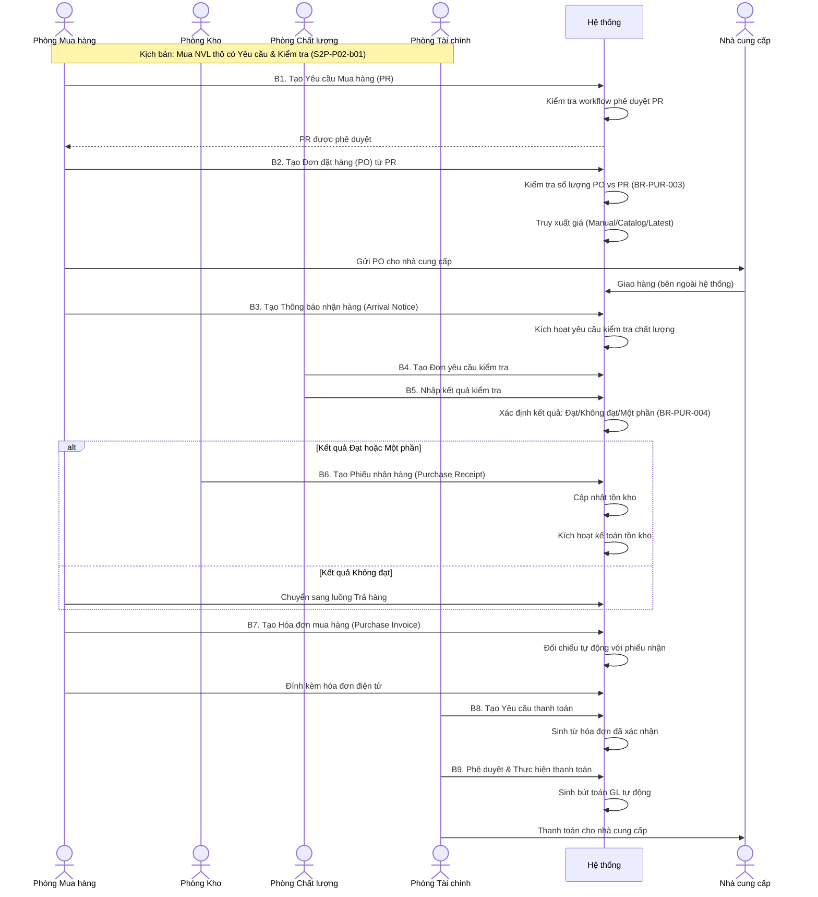

# ĐẶC TẢ NGHIỆP VỤ: QUẢN LÝ MUA HÀNG (PURCHASING MANAGEMENT)

> **Mã phân hệ**: SCM-PUR
> **Phiên bản**: 1.0.0
> **Ngày cập nhật**: 2026-07-24
> **Tài liệu nguồn**:
> - Slide: YonSuite Partner Implementation Training_SCM_Puchasing Management_20260722(sent).pdf
> - Tài liệu ghi chú: _MConverter.eu_ERP Youyon.md
> - Sơ đồ Mindmap: mindmap1.jpg - mindmap4.jpg

---

## 1. Mục tiêu & Phạm vi nghiệp vụ (Goal & Scope)

Phân hệ Quản lý Mua hàng (Purchasing Management) trong YonSuite SCM Cloud cung cấp giải pháp toàn diện cho quy trình mua sắm từ yêu cầu đến thanh toán (Procure-to-Pay / S2P). Hệ thống hỗ trợ doanh nghiệp quản lý toàn bộ vòng đời mua hàng, từ phát sinh nhu cầu, đặt hàng, nhận hàng, kiểm tra chất lượng, xử lý hóa đơn đến thanh toán cho nhà cung cấp.

**Phạm vi bao gồm 6 kịch bản nghiệp vụ chính:**
1. Mua nguyên vật liệu thô (có Yêu cầu mua hàng & Kiểm tra chất lượng)
2. Trả hàng mua
3. Mua nguyên vật liệu thô (không kiểm tra chất lượng)
4. Mua tài sản cố định
5. Chi phí mua hàng
6. Mua dịch vụ

**Đối tượng phục vụ chính:** Doanh nghiệp có quy trình mua sắm chuyên nghiệp, hoạt động trong môi trường pháp nhân đơn lẻ, cần kiểm soát chi phí và chất lượng đầu vào.

---

## 2. Đối tượng tham gia (Actors)

| Actor | Mô tả vai trò nghiệp vụ |
| :--- | :--- |
| **Phòng/Bộ phận Mua hàng (Purchase Dept.)** | Chịu trách nhiệm tạo Yêu cầu Mua hàng (PR), lựa chọn nhà cung cấp, tạo Đơn đặt hàng (PO), đàm phán giá, theo dõi tiến độ giao hàng, xử lý hóa đơn mua hàng. |
| **Phòng/Bộ phận Kho (Warehouse Dept.)** | Tiếp nhận thông báo nhận hàng, thực hiện nhận hàng vật lý, tạo phiếu nhận kho, quản lý số lượng thực nhận, xử lý trả hàng. |
| **Phòng/Bộ phận Chất lượng (Quality Dept.)** | Thực hiện kiểm tra chất lượng hàng hóa đầu vào, ghi nhận kết quả kiểm tra Đạt/Không đạt/Một phần, quyết định chấp nhận hoặc từ chối lô hàng. |
| **Phòng/Bộ phận Tài chính (Finance Dept.)** | Xác nhận hóa đơn mua hàng, tạo yêu cầu thanh toán, thực hiện thanh toán cho nhà cung cấp, quản lý công nợ, hạch toán kế toán. |
| **Phòng/Bộ phận Kế hoạch & Sản xuất (Planning & Prod. Dept.)** | Khởi tạo nhu cầu mua hàng từ kế hoạch sản xuất, chuyển đơn hàng bán thành yêu cầu nguyên vật liệu. |
| **Phòng Kinh doanh (Sales Dept.)** | Tạo đơn hàng bán, gián tiếp kích hoạt nhu cầu mua hàng thông qua kế hoạch sản xuất. |
| **Hệ thống (System)** | Tự động hóa các tác vụ: kiểm tra số lượng vượt mức, truy xuất giá, tính toán thuế/tỷ giá, sinh chứng từ liên quan, gửi thông báo, tự động đóng PO, tự động thanh toán khi hóa đơn được duyệt, kích hoạt luồng phê duyệt. |
| **Nhà cung cấp (Supplier)** | Bên ngoài hệ thống - Nhận đơn hàng, giao hàng, gửi hóa đơn, nhận thanh toán, tiếp nhận hàng trả lại. |

---

## 3. Sơ đồ Quy trình Nghiệp vụ (Business Workflow)

### 3.1 Luồng tổng quan các kịch bản mua hàng

### 3.2 Luồng Mua nguyên vật liệu thô có kiểm tra (Kịch bản chính)

---

## 4. Đặc tả chi tiết các bước nghiệp vụ (Business Steps)

### 4.1 Luồng nghiệp vụ chính: Mua nguyên vật liệu thô có Yêu cầu & Kiểm tra

| Bước | Actor | Hành động & Chi tiết xử lý | Dữ liệu Đầu vào (Inputs) | Dữ liệu Đầu ra & Trạng thái (Outputs) | Liên kết Rules |
| :--- | :--- | :--- | :--- | :--- | :--- |
| **1** | Phòng Mua hàng | **Tạo Yêu cầu Mua hàng (PR):** Người dùng tạo PR mới, chọn loại giao dịch "Purchase Requisition", nhập thông tin vật liệu, số lượng yêu cầu, ngày cần hàng, đơn vị yêu cầu. Có thể nhập thủ công hoặc import hàng loạt qua Excel. | - Mã vật liệu, Số lượng yêu cầu, Ngày cần hàng, Đơn vị yêu cầu, Kho đích | - PR ở trạng thái "Đã lưu" → "Đang phê duyệt" → "Đã phê duyệt" | `BR-PUR-001` |
| **2** | Hệ thống | **Phê duyệt PR:** Hệ thống tự động kích hoạt workflow phê duyệt đã được thiết lập cho loại giao dịch PR. Có thể cấu hình phê duyệt đa cấp. | - PR đã lưu, Cấu hình workflow | - PR được phê duyệt, sẵn sàng tạo PO | `BR-PUR-002` |
| **3** | Phòng Mua hàng | **Tạo Đơn đặt hàng (PO) từ PR:** Người dùng chọn chức năng "Purchase Requisition Generation", chọn PR tham chiếu, nhấn "Generate Document". Hệ thống tự động điền thông tin từ PR. Người dùng chọn nhà cung cấp, xác nhận đơn giá, ngày dự kiến nhận hàng, điều khoản thanh toán. | - PR đã phê duyệt, Mã nhà cung cấp, Đơn giá, Ngày dự kiến nhận, Điều khoản thanh toán | - PO ở trạng thái "Đã lưu" → "Đã gửi/phê duyệt" | `BR-PUR-003`, `BR-PUR-005` |
| **4** | Phòng Mua hàng | **Gửi PO cho Nhà cung cấp:** Sử dụng tính năng "Publish" để gửi PO cho nhà cung cấp qua email hoặc cổng thông tin. PO được gửi kèm các điều khoản và thông tin giao hàng. | - PO đã phê duyệt | - PO đã gửi, Nhà cung cấp nhận đơn hàng | `BR-PUR-006` |
| **5** | Phòng Mua hàng | **Tạo Thông báo nhận hàng (Arrival Notice):** Khi nhận được thông tin hàng sắp về, người dùng chọn "Purchase Order Arrival", chọn PO tham chiếu, tạo thông báo. Kích hoạt cờ "Inspection = Yes" nếu cần kiểm tra chất lượng. Có thể in biểu mẫu thông báo cho thủ kho. | - PO đã gửi, Kho nhận hàng, Cờ Kiểm tra = Yes/No | - Thông báo nhận hàng đã tạo, Yêu cầu kiểm tra chất lượng (nếu có) | `BR-PUR-007` |
| **6** | Phòng Chất lượng | **Tạo & Thực hiện Kiểm tra chất lượng:** Tạo "Incoming Material Inspection Requisition" từ Arrival Notice. Thực hiện kiểm tra thực tế, nhập kết quả cho từng chỉ tiêu kiểm tra. Hệ thống tự động tổng hợp kết quả. | - Thông báo nhận hàng, Chỉ tiêu kiểm tra, Kết quả từng chỉ tiêu | - Kết quả kiểm tra: Đạt / Không đạt / Một phần đạt | `BR-PUR-004`, `BR-PUR-008` |
| **7** | Phòng Kho | **Tạo Phiếu nhận hàng (Purchase Receipt):** Nếu kết quả kiểm tra Đạt/Một phần, thủ kho chọn "Purchase Arrival Receipt" hoặc "Purchased Goods Receipt", chọn chứng từ tham chiếu. Nhập số lượng thực nhận, chỉ định kho nhận, vị trí lưu trữ. | - Arrival Notice / Inspection Result, Kho nhận, Số lượng thực nhận, Vị trí bin (nếu có) | - Phiếu nhận hàng đã lưu & phê duyệt, Tồn kho cập nhật, Kế toán tồn kho kích hoạt | `BR-PUR-009`, `BR-PUR-010` |
| **8** | Phòng Mua hàng | **Tạo Hóa đơn mua hàng (Purchase Invoice):** Từ phiếu nhận hàng, tạo hóa đơn. Hệ thống tự động điền thông tin vật liệu từ phiếu nhận. Người dùng nhập số hóa đơn, ngày hóa đơn, đính kèm file hóa đơn điện tử. | - Phiếu nhận hàng, Số hóa đơn NCC, Ngày hóa đơn, File hóa đơn điện tử | - Hóa đơn mua hàng đã lưu, Đối chiếu tự động (nếu cấu hình) | `BR-PUR-011`, `BR-PUR-012` |
| **9** | Phòng Tài chính | **Tạo Yêu cầu thanh toán (Payment Application):** Truy cập Finance Cloud > A/P, tạo Payment Application từ Purchase Invoice đã xác nhận. Xác nhận số tiền, điều khoản thanh toán, ngày đến hạn. | - Hóa đơn mua hàng đã xác nhận, Thông tin thanh toán NCC | - Yêu cầu thanh toán đã lưu & gửi duyệt | `BR-PUR-013` |
| **10** | Phòng Tài chính | **Thực hiện thanh toán (Payment Document):** Tạo Payment Document từ Payment Application đã phê duyệt. Xác nhận phương thức thanh toán, số tài khoản, ngày thanh toán. | - Yêu cầu thanh toán đã duyệt, Phương thức thanh toán, TK ngân hàng | - Chứng từ thanh toán đã hoàn thành, Bút toán GL tự động | `BR-PUR-014`, `BR-PUR-015` |

### 4.2 Luồng nghiệp vụ rẽ nhánh / thay thế (Alternative Flows)

- **Alt-Flow B3.KhôngKiểmTra: Mua NVL không kiểm tra chất lượng (S2P-P02-b02)**
  - Điều kiện kích hoạt: Vật liệu không yêu cầu kiểm tra chất lượng đầu vào (Purchase Inspection = No trên Master Data)
  - Các bước thực hiện:
    1. Bỏ qua Bước 6 (Kiểm tra chất lượng).
    2. Sau Thông báo nhận hàng (B5) → chuyển thẳng đến Tạo Phiếu nhận hàng (B7).
    3. Quy trình rút gọn: PR → PO → Arrival Notice → Purchase Receipt → Invoice → Payment.
  - Tham chiếu: `BR-PUR-016`

- **Alt-Flow B3.MuaTaiSan: Mua tài sản cố định (S2P-P02-b05)**
  - Điều kiện kích hoạt: Vật liệu có thuộc tính "Equipment" và chế độ quản lý giá trị "Fixed Asset"
  - Các bước thực hiện:
    1. Sử dụng loại giao dịch "Asset Receiving" khi tạo phiếu nhận.
    2. Chọn phương thức tạo thẻ tài sản: "Create a card from receipt document".
    3. Hệ thống tạo thẻ tài sản (Asset Card) tự động từ phiếu nhận.
    4. Phòng Tài chính quản lý tài sản cố định (khấu hao, bảo trì) từ Asset Cloud & Finance Cloud.
    5. Tạo thẻ tài sản có thể là 1-1 (1 thiết bị = 1 thẻ) hoặc 1-n (nhiều thiết bị = 1 thẻ).
  - Tham chiếu: `BR-PUR-017`, `BR-PUR-018`

- **Alt-Flow B3.MuaDichVu: Mua dịch vụ (S2P-P02-b08)**
  - Điều kiện kích hoạt: Vật liệu có thuộc tính "Service" (không phải hàng hóa vật lý)
  - Các bước thực hiện:
    1. Không có bước Arrival Notice và Purchase Receipt.
    2. Thay thế bằng bước Xác nhận dịch vụ (Service Confirmation).
    3. PO → Service Confirmation → Purchase Invoice → Payment.
    4. Service Confirmation xác nhận giá trị thanh toán cho nhà cung cấp.
  - Tham chiếu: `BR-PUR-019`

- **Alt-Flow B3.ChiPhiMuaHang: Chi phí mua hàng (S2P-P02-h02)**
  - Điều kiện kích hoạt: Phát sinh chi phí ngoài đơn hàng (logistics, hải quan, kiểm tra đột xuất...)
  - Các bước thực hiện:
    1. Sau Purchase Receipt → tạo Supply Chain Expense.
    2. Chi phí được hạch toán bổ sung vào đơn hàng tương ứng.
    3. PO → Purchase Receipt → Supply Chain Expense → Purchase Invoice → Payment.
  - Tham chiếu: `BR-PUR-020`

- **Alt-Flow B3.ThanhToanGiaiDoan: Thanh toán theo giai đoạn (Phased Payment)**
  - Điều kiện kích hoạt: Khi PO có thiết lập kế hoạch thanh toán (Payment Plan) nhiều giai đoạn
  - Các bước thực hiện:
    1. Thiết lập Payment Plan trực tiếp trên PO (VD: 30% đặt cọc, 70% thanh toán sau).
    2. Hệ thống tự động tính toán số tiền từng giai đoạn.
    3. Tạo Payment Application cho từng giai đoạn.
    4. Hai Payment Document riêng biệt được sinh ra.
  - Tham chiếu: `BR-PUR-021`

### 4.3 Luồng ngoại lệ / Xử lý lỗi (Exception Flows)

- **Exc-Flow B3.TrảHàng: Trả hàng mua (Purchase Return - S2P-P02-b11)**
  - Điều kiện kích hoạt: Hàng hóa bị lỗi, sai quy cách, hoặc các vấn đề về chất lượng từ nhà cung cấp
  - Hai tình huống:
    - **Tình huống 1 - Trả hàng trực tiếp:** Tạo Return Purchase Order trực tiếp (không tham chiếu chứng từ nguồn).
    - **Tình huống 2 - Trả hàng có tham chiếu:** Tìm PO gốc của linh kiện lỗi, tạo yêu cầu trả hàng từ Purchase Receipt.
  - Các bước xử lý:
    1. Tạo Return Purchase Order (chọn loại giao dịch "Purchase Return").
    2. Tạo Purchase Receipt với số lượng âm (ghi nhận hàng trả lại).
    3. Kho tiến hành trả hàng vật lý cho nhà cung cấp.
    4. Tạo Purchase Invoice với số âm (Credit Note / Ghi nợ nhà cung cấp).
    5. Luồng tài liệu: Return PO → Return Receipt → Credit Note.
  - Tham chiếu: `BR-PUR-022`

- **Exc-Flow B8.SaiLechHoaDon: Xử lý chênh lệch hóa đơn**
  - Điều kiện kích hoạt: Hóa đơn nhà cung cấp có sai lệch về số lượng hoặc đơn giá so với phiếu nhận hàng
  - Cách xử lý: Hệ thống hỗ trợ quy trình xử lý chênh lệch (Variances). Bộ phận mua hàng đối chiếu và quyết định chấp nhận hoặc yêu cầu điều chỉnh.

- **Exc-Flow B7.SoLuongVuotMuc: Số lượng nhận vượt mức cho phép**
  - Điều kiện kích hoạt: Số lượng thực nhận vượt quá dung sai cho phép của PO
  - Cách xử lý: Hệ thống cảnh báo hoặc chặn tùy theo cấu hình "Allow Arrival and Receipt Quantity Exceeding Order Quantity" và tham số "Sealing of Over-Receiving" trên Master Data vật liệu. Xem `BR-PUR-009`, `BR-PUR-010`.

---

## 5. Đặc tả thông tin nghiệp vụ (Information Schema)

### 5.1 Thực thể: Yêu cầu Mua hàng (Purchase Requisition - PR)

| # | Tên trường | Kiểu dữ liệu | Bắt buộc | Quy tắc xác thực & Ràng buộc nghiệp vụ |
| :--- | :--- | :--- | :--- | :--- |
| 1 | Mã PR | Text/Mã | Y | Tự động sinh theo quy tắc đánh mã của hệ thống |
| 2 | Loại giao dịch | Danh mục | Y | Mặc định: "Purchase Requisition". Xem `BR-PUR-001` |
| 3 | Đơn vị kinh doanh | Danh mục | Y | Phải là đơn vị đã kích hoạt Purchasing Organization |
| 4 | Phòng ban yêu cầu | Danh mục | Y | Thuộc đơn vị kinh doanh đã chọn |
| 5 | Mã vật liệu | Danh mục | Y | Phải có thuộc tính "Purchase" = Yes |
| 6 | Số lượng yêu cầu | Số thực | Y | > 0 |
| 7 | Đơn vị tính | Danh mục | Y | Theo đơn vị tính chính của vật liệu |
| 8 | Ngày cần hàng | Ngày | Y | ≥ Ngày hiện tại |
| 9 | Kho đích | Danh mục | N | Kho dự kiến nhận hàng |
| 10 | Người yêu cầu | Text | Y | Tự động điền từ user đăng nhập |
| 11 | Trạng thái | Danh mục | Y | Đã lưu → Đang phê duyệt → Đã phê duyệt → Đã đóng |

### 5.2 Thực thể: Đơn đặt hàng (Purchase Order - PO)

| # | Tên trường | Kiểu dữ liệu | Bắt buộc | Quy tắc xác thực & Ràng buộc nghiệp vụ |
| :--- | :--- | :--- | :--- | :--- |
| 1 | Mã PO | Text/Mã | Y | Tự động sinh |
| 2 | Loại giao dịch | Danh mục | Y | Regular Purchase / Asset Receiving / Purchase Return |
| 3 | Mã PR tham chiếu | Text/Mã | N | Liên kết với PR gốc (nếu PO sinh từ PR) |
| 4 | Nhà cung cấp | Danh mục | Y | Phải có trong danh sách nhà cung cấp được phê duyệt. Xem `BR-PUR-006` |
| 5 | Mã vật liệu | Danh mục | Y | Phải có thuộc tính "Purchase" = Yes |
| 6 | Số lượng đặt hàng | Số thực | Y | > 0. Kiểm soát vượt mức với PR. Xem `BR-PUR-003` |
| 7 | Đơn vị tính | Danh mục | Y | Theo đơn vị tính mua hàng |
| 8 | Đơn giá | Tiền tệ | Y | Theo phương pháp truy xuất giá. Xem `BR-PUR-005` |
| 9 | Loại tiền tệ | Danh mục | Y | Kèm tỷ giá tự động từ hệ thống |
| 10 | Ngày dự kiến nhận hàng | Ngày | Y | ≥ Ngày tạo PO |
| 11 | Điều khoản thanh toán | Danh mục | N | VD: Net 30, Net 60... |
| 12 | Kế hoạch thanh toán | Bảng con | N | Thiết lập nếu thanh toán theo giai đoạn. Xem `BR-PUR-021` |
| 13 | Tổng giá trị PO | Tiền tệ | Y | Tự động tính: SL × Đơn giá + Thuế - Chiết khấu |
| 14 | Trạng thái | Danh mục | Y | Đã lưu → Đã gửi → Đã xác nhận → Đã nhận hàng → Đã đóng |

### 5.3 Thực thể: Phiếu nhận hàng (Purchase Receipt)

| # | Tên trường | Kiểu dữ liệu | Bắt buộc | Quy tắc xác thực & Ràng buộc nghiệp vụ |
| :--- | :--- | :--- | :--- | :--- |
| 1 | Mã phiếu nhận | Text/Mã | Y | Tự động sinh |
| 2 | Loại giao dịch | Danh mục | Y | Regular Purchase / Asset Receiving |
| 3 | Mã PO tham chiếu | Text/Mã | Y | Liên kết với PO đã gửi |
| 4 | Mã Arrival Notice | Text/Mã | N | Liên kết với thông báo nhận hàng (nếu có) |
| 5 | Kho nhận | Danh mục | Y | Phải thuộc tổ chức kho đã cấu hình |
| 6 | Mã vật liệu | Danh mục | Y | Khớp với PO |
| 7 | Số lượng thực nhận | Số thực | Y | > 0. Kiểm soát vượt mức PO. Xem `BR-PUR-010` |
| 8 | Vị trí bin | Danh mục | N | Nếu kho có quản lý bin |
| 9 | Số lô (Batch) | Text | N | Nếu vật liệu có Batch Management = Yes |
| 10 | Trạng thái tồn kho | Danh mục | Y | Mặc định: Qualified. Xem `BR-PUR-023` |
| 11 | Kết quả kiểm tra | Text | N | Tham chiếu đến kết quả Inspection |
| 12 | Trạng thái | Danh mục | Y | Đã lưu → Đã xác nhận → Đã hạch toán |

### 5.4 Thực thể: Hóa đơn mua hàng (Purchase Invoice)

| # | Tên trường | Kiểu dữ liệu | Bắt buộc | Quy tắc xác thực & Ràng buộc nghiệp vụ |
| :--- | :--- | :--- | :--- | :--- |
| 1 | Mã hóa đơn hệ thống | Text/Mã | Y | Tự động sinh |
| 2 | Số hóa đơn NCC | Text | Y | Số hóa đơn từ nhà cung cấp |
| 3 | Ngày hóa đơn | Ngày | Y | Ngày trên hóa đơn NCC |
| 4 | Mã phiếu nhận tham chiếu | Text/Mã | Y | Liên kết với Purchase Receipt |
| 5 | Mã vật liệu | Danh mục | Y | Tự động điền từ phiếu nhận |
| 6 | Số lượng hóa đơn | Số thực | Y | Khớp với số lượng thực nhận |
| 7 | Đơn giá hóa đơn | Tiền tệ | Y | Có thể khác PO → xử lý chênh lệch |
| 8 | Tổng tiền hóa đơn | Tiền tệ | Y | Tự động tính |
| 9 | Thuế GTGT | Tiền tệ | Y | Tự động tính theo tỷ lệ thuế NCC |
| 10 | File hóa đơn điện tử | File | N | Upload scan hoặc e-invoice |
| 11 | Trạng thái | Danh mục | Y | Đã lưu → Đã đối chiếu → Đã duyệt → Đã thanh toán |

### 5.5 Thực thể: Thẻ tài sản cố định (Asset Card) - Áp dụng cho mua TSCĐ

| # | Tên trường | Kiểu dữ liệu | Bắt buộc | Quy tắc xác thực & Ràng buộc nghiệp vụ |
| :--- | :--- | :--- | :--- | :--- |
| 1 | Mã thẻ tài sản | Text/Mã | Y | Tự động sinh hoặc nhập tay |
| 2 | Tên tài sản | Text | Y | Theo tên vật liệu/thết bị |
| 3 | Danh mục TSCĐ | Danh mục | Y | Cấu trúc danh mục TSCĐ đã thiết lập |
| 4 | Phương thức tăng | Danh mục | Y | Mua sắm / Tự xây dựng... |
| 5 | Phương thức khấu hao | Danh mục | Y | Đường thẳng / Số dư giảm dần... |
| 6 | Nguyên giá | Tiền tệ | Y | Từ giá mua trên PO |
| 7 | Ngày đưa vào sử dụng | Ngày | Y | Ngày nhận tài sản |
| 8 | Trạng thái | Danh mục | Y | Đang sử dụng / Bảo trì / Thanh lý... |
| 9 | Mã phiếu nhận tham chiếu | Text/Mã | Y | Liên kết ngược với Purchase Receipt |

---

## 6. Điểm tích hợp hệ thống (Integration Points)

### 6.1 Các tích hợp hiện có

| Tên hệ thống liên kết | Mục đích tích hợp | Giao thức/Phương thức | Chiều dữ liệu & Nội dung chính |
| :--- | :--- | :--- | :--- |
| **Finance Cloud (A/P)** | Xử lý công nợ phải trả, tạo yêu cầu thanh toán và chứng từ thanh toán từ hóa đơn mua hàng | Nội bộ YonSuite (Sync/Realtime) | **Gửi:** Mã hóa đơn, Số tiền, Điều khoản thanh toán, Mã NCC **Nhận:** Trạng thái thanh toán, Bút toán GL |
| **Finance Cloud (GL)** | Hạch toán kế toán tổng hợp tự động khi hoàn thành nhận hàng và thanh toán | Nội bộ YonSuite (Sync/Realtime) | **Gửi:** Chứng từ nhập/xuất kho, Chứng từ thanh toán **Nhận:** Bút toán GL đã ghi sổ |
| **Finance Cloud (Inventory Accounting)** | Tính toán giá vốn hàng nhập kho, hạch toán kế toán tồn kho | Nội bộ YonSuite (Sync/Realtime) | **Gửi:** Phiếu nhận hàng, Chi phí mua hàng **Nhận:** Giá vốn nhập kho, Bút toán kế toán tồn kho |
| **Finance Cloud (Fixed Asset)** | Quản lý tài sản cố định: tạo thẻ tài sản, tính khấu hao, quản lý bảo trì | Nội bộ YonSuite (Sync/Realtime) | **Gửi:** Phiếu nhận tài sản (Asset Receipt) **Nhận:** Thẻ tài sản, Lịch khấu hao |
| **Asset Cloud** | Tạo và quản lý thẻ tài sản từ phiếu nhận tài sản | Nội bộ YonSuite (Sync/Realtime) | **Gửi:** Thông tin thiết bị, nguyên giá **Nhận:** Mã thẻ tài sản, Trạng thái |
| **Manufacturing Cloud (Quality Control)** | Nhận yêu cầu kiểm tra chất lượng từ Arrival Notice, trả kết quả để quyết định nhận/trả hàng | Nội bộ YonSuite (Sync/Realtime) | **Gửi:** Arrival Notice, Mã vật liệu, SL kiểm **Nhận:** Kết quả Đạt/Không đạt/Một phần |
| **Inventory Management** | Cập nhật tồn kho khi nhận hàng, kiểm tra số lượng khả dụng, quản lý trạng thái tồn kho | Nội bộ YonSuite (Sync/Realtime) | **Gửi:** Phiếu nhận hàng (Purchase Receipt) **Nhận:** Tồn kho đã cập nhật, Số lượng khả dụng |
| **Digital Modeling (Workflow)** | Kích hoạt luồng phê duyệt cho PR, PO, và các chứng từ mua hàng | Nội bộ YonSuite (Sync/Realtime) | **Gửi:** Chứng từ cần phê duyệt **Nhận:** Kết quả phê duyệt (Duyệt/Từ chối) |

### 6.2 Các tích hợp đề xuất (Recommendations)

- **Cổng thông tin Nhà cung cấp (Supplier Portal)**: Tích hợp cổng tự phục vụ cho phép nhà cung cấp tự xác nhận PO, cập nhật tiến độ giao hàng, gửi hóa đơn điện tử trực tiếp vào hệ thống, giảm thiểu nhập liệu thủ công và sai sót.
- **Hệ thống Đấu thầu Điện tử (E-Procurement / E-Sourcing)**: Tích hợp quy trình đấu thầu, so sánh báo giá tự động từ nhiều nhà cung cấp trước khi tạo PO để tối ưu chi phí.
- **Hệ thống CRM**: Liên kết thông tin đơn hàng bán để tự động kích hoạt nhu cầu mua hàng khi tồn kho không đủ đáp ứng (kịch bản Order-to-Cash → Procure-to-Pay).
- **Dịch vụ Tỷ giá Ngân hàng (Bank FX Rate API)**: Tự động cập nhật tỷ giá ngoại tệ theo thời gian thực từ ngân hàng để tính toán chính xác giá trị đơn hàng ngoại tệ.

---

## 7. Quy tắc nghiệp vụ (Business Rules - BR)

| Mã Rule | Tên Quy tắc | Mô tả chi tiết quy tắc nghiệp vụ | Nguồn tham chiếu |
| :--- | :--- | :--- | :--- |
| **BR-PUR-001** | Loại giao dịch PR | Khi tạo PR mới, loại giao dịch mặc định phải là "Purchase Requisition". Có thể tạo PR thủ công hoặc import hàng loạt qua Excel template. | Slide Purchasing Mgt |
| **BR-PUR-002** | Phê duyệt PR bằng Workflow | PR phải được phê duyệt theo workflow đã thiết lập trước khi có thể tạo PO. Workflow hỗ trợ phê duyệt đa cấp, có thể thiết kế kéo-thả trong Digital Modeling > Workflow. | Slide Purchasing Mgt |
| **BR-PUR-003** | Kiểm soát số lượng PO vượt PR | Nếu tham số "Allow Order Quantity Exceeding PR Quantity" = Yes: SL PO tối đa = SL PR × (1 + Tỷ lệ cho phép vượt). VD: PR 100, tỷ lệ 10% → PO tối đa 110. Nếu = No: Không giới hạn. | Slide p.26 |
| **BR-PUR-004** | Quy tắc tổng hợp kết quả kiểm tra | 1. Tất cả kết quả Đạt → Đánh giá chung: Đạt. 2. Tất cả kết quả Không đạt → Đánh giá chung: Không đạt. 3. Kết hợp Đạt và Không đạt → Đánh giá chung: Một phần đạt (Partially Qualified). | Slide p.44 |
| **BR-PUR-005** | Phương pháp truy xuất giá | 3 phương pháp: (a) Manual Entry - nhập tay, (b) Price Catalog - lấy từ danh mục giá, (c) Latest Purchase Price - lấy giá mua gần nhất. Khi dùng Price Catalog, giá tự động cập nhật lại khi thay đổi NCC, tiền tệ, đơn vị tính, số lượng hoặc ngày chứng từ. | Slide p.24-25 |
| **BR-PUR-006** | Kiểm soát nhà cung cấp (Supplier Supply Control) | Nếu bật "Supplier Supply Control", hệ thống kiểm tra mối quan hệ NCC-Vật liệu trong danh mục cung ứng. PO chỉ được tạo với NCC đã được phê duyệt cho vật liệu đó. | Slide p.28 |
| **BR-PUR-007** | Kích hoạt kiểm tra chất lượng | Cờ "Inspection" trên Arrival Notice phải được bật (Yes) nếu vật liệu yêu cầu kiểm tra (Purchase Inspection = Yes và Purchase Inspection Control Point được thiết lập trên Master Data vật liệu). | Slide p.40 |
| **BR-PUR-008** | Điểm kiểm soát chất lượng | Trên Master Data vật liệu, Purchase Inspection Control Point xác định thời điểm kiểm tra: khi nhận hàng (Receipt) hoặc sau khi nhập kho. Điều này ảnh hưởng đến việc hàng được đưa vào kho trước hay sau kiểm tra. | Slide p.16 |
| **BR-PUR-009** | Kiểm soát số lượng nhận vượt Arrival | Nếu "Allow Arrival and Receipt Quantity Exceeding Order Quantity" = Yes: có giới hạn vượt theo dung sai. = No: không hạn chế. Áp dụng cho cả Arrival Notice và Purchase Receipt. | Slide p.27 |
| **BR-PUR-010** | Dung sai nhận hàng (Sealing of Over-Receiving) | Trên Master Data vật liệu, tham số "Sealing of Over-Receiving" xác định tỷ lệ % tối đa được phép nhận vượt so với số lượng PO. Số lượng thực nhận ≤ SL PO × (1 + Tỷ lệ cho phép). | Slide p.18, ERP Notes |
| **BR-PUR-011** | Tự động đối chiếu hóa đơn (Auto Settle) | Nếu bật "Auto Settle upon Procurement Invoice Approval", khi hóa đơn được tạo tham chiếu từ phiếu nhận và được phê duyệt, hệ thống tự động đối chiếu và sinh chứng từ procurement settlement. | Slide p.28 |
| **BR-PUR-012** | Giá trần mua hàng (Ceiling Price Limit) | Tham số kiểm soát giá mua không được vượt quá mức giá trần đã định nghĩa (local-currency tax-inclusive unit price). | Slide p.24 |
| **BR-PUR-013** | Yêu cầu thanh toán từ hóa đơn | Payment Application được tạo từ Purchase Invoice đã xác nhận. Số tiền đề nghị thanh toán tự động từ hóa đơn, có thể điều chỉnh. | ERP Notes |
| **BR-PUR-014** | Tự động đóng nghiệp vụ (Auto Close) | Hệ thống hỗ trợ tự động đóng các nghiệp vụ: Đóng nhận hàng (Receipt Closure), Đóng nhập kho (Stock-In Closure), Đóng hóa đơn (Invoicing Closure), Đóng thanh toán (Payment Closure). | Slide p.28 |
| **BR-PUR-015** | Bút toán GL tự động | Khi hoàn thành thanh toán, hệ thống tự động sinh bút toán GL tương ứng: Nợ Công nợ / Có Tiền gửi ngân hàng. | ERP Notes |
| **BR-PUR-016** | Bỏ qua kiểm tra chất lượng | Vật liệu có Purchase Inspection = No trên Master Data sẽ tự động bỏ qua bước kiểm tra chất lượng trong quy trình mua hàng. | Slide, ERP Notes |
| **BR-PUR-017** | Cấu hình vật liệu TSCĐ | Để mua tài sản cố định: Property = "Equipment", Financial Cost Value Management = "Fixed Asset". Không thể thay đổi khi vật liệu đã được tham chiếu bởi chứng từ nghiệp vụ. | Slide p.15 |
| **BR-PUR-018** | Tạo thẻ tài sản từ phiếu nhận | Thẻ tài sản có thể tạo tự động từ phiếu nhận tài sản (Asset Receipt) với 2 tùy chọn: 1-1 (1 thiết bị = 1 thẻ) hoặc 1-n (nhiều thiết bị = 1 thẻ). Cần cấu trúc danh mục TSCĐ, phương thức tăng, phương thức khấu hao. | Slide, ERP Notes |
| **BR-PUR-019** | Mua dịch vụ - Xác nhận dịch vụ | Đối với vật liệu loại "Service": không có Arrival Notice và Purchase Receipt. Thay thế bằng Service Confirmation để xác nhận giá trị thanh toán. | Slide p.5, ERP Notes |
| **BR-PUR-020** | Chi phí mua hàng bổ sung | Purchase Expense (logistics, hải quan...) được tạo sau Purchase Receipt, hạch toán bổ sung vào đơn hàng gốc. Sử dụng chức năng Supply Chain Expense. | Slide p.5, ERP Notes |
| **BR-PUR-021** | Thanh toán theo giai đoạn | Kế hoạch thanh toán được thiết lập trực tiếp trên PO. Hệ thống tự động tính số tiền từng giai đoạn theo tỷ lệ. Payment Application được tạo riêng cho từng giai đoạn. VD: 30% đặt cọc, 70% thanh toán sau khi nhận hàng. | Slide p.56-58 |
| **BR-PUR-022** | Trả hàng - Hóa đơn âm | Khi trả hàng, sử dụng Purchase Invoice với số lượng âm để tạo Credit Note (Ghi nợ) cho nhà cung cấp. Luồng tài liệu: Return PO → Return Receipt (số âm) → Credit Note (số âm). | Slide p.4, ERP Notes |
| **BR-PUR-023** | Trạng thái tồn kho khi nhận hàng | Tồn kho sau khi nhận hàng mặc định ở trạng thái "Qualified". Nếu có kiểm tra chất lượng, trạng thái có thể là "Pending Inspection" cho đến khi có kết quả kiểm tra. | ERP Notes |
| **BR-PUR-024** | Tham số tiền tệ và tỷ giá | Loại tiền tệ và tỷ giá được tự động điền khi tạo PO (từ Master Data NCC). Người dùng có thể sửa đổi theo nhu cầu thực tế. Tỷ giá có thể nhập thủ công hoặc lấy từ dịch vụ đám mây. | ERP Notes |
| **BR-PUR-025** | Thiết lập sổ kế toán | Trước khi vận hành, cần cấu hình Accounting Book: kích hoạt GL, Inventory Accounting, A/R, A/P, Fixed Assets. Cấu hình Cost Area cho tổ chức kho và warehouse. | Slide p.18-19 |

---

## 8. Đề xuất & Lưu ý thiết kế (Recommendations & Design Considerations)

| Mã Rec | Phân loại | Nội dung đề xuất / Lưu ý thiết kế | Lợi ích mang lại |
| :--- | :--- | :--- | :--- |
| **REC-PUR-001** | UX | Hiển thị trạng thái tồn kho khả dụng (Available Quantity) ngay trên màn hình tạo PR/PO để người dùng biết có cần mua gấp hay không. | Giảm thời gian tra cứu, quyết định nhanh hơn. |
| **REC-PUR-002** | UX | Cảnh báo khi tạo PO với nhà cung cấp có lịch sử giao hàng trễ hoặc chất lượng kém (dựa trên dữ liệu lịch sử kiểm tra chất lượng). | Hỗ trợ quyết định lựa chọn NCC. |
| **REC-PUR-003** | Kỹ thuật | Sử dụng cơ chế bất đồng bộ (async) khi gửi email/publish PO cho nhà cung cấp để tránh chặn giao diện người dùng. | Cải thiện trải nghiệm người dùng, không bị treo màn hình. |
| **REC-PUR-004** | Kỹ thuật | Thiết lập index cho các trường thường xuyên tìm kiếm: Mã PO, Mã NCC, Mã vật liệu, Trạng thái PO, Ngày tạo PO để tối ưu hiệu năng tra cứu Document Flow. | Tăng tốc độ truy vấn, đặc biệt với lượng giao dịch lớn. |
| **REC-PUR-005** | Tối ưu | Tự động sinh PR từ kế hoạch sản xuất (MRP) hoặc khi tồn kho xuống dưới mức Reorder Point đã thiết lập trên Master Data vật liệu. | Giảm thao tác thủ công, tránh thiếu hụt nguyên vật liệu. |
| **REC-PUR-006** | Tối ưu | Thiết lập cảnh báo tự động (email/in-app) cho các PO sắp đến ngày giao hàng dự kiến nhưng chưa có Arrival Notice. | Chủ động theo dõi tiến độ, giảm rủi ro thiếu hàng. |
| **REC-PUR-007** | Tối ưu | Đề xuất tự động đóng PO khi đã nhận đủ hàng và thanh toán hoàn tất (sử dụng Auto Close Business Rules). | Giảm thao tác thủ công đóng PO, giữ dữ liệu sạch. |
| **REC-PUR-008** | UX | Cho phép kéo-thả file hóa đơn điện tử (PDF/XML) vào màn hình tạo Purchase Invoice thay vì chỉ có nút Upload. | Tăng tốc thao tác nhập liệu hóa đơn. |
| **REC-PUR-009** | Kỹ thuật | Hỗ trợ OCR tự động trích xuất thông tin từ hóa đơn điện tử (số hóa đơn, ngày, số tiền, thuế) để tự động điền vào form Purchase Invoice. | Giảm sai sót nhập liệu, tiết kiệm thời gian. |

---

## 9. Câu hỏi cần làm rõ (Open Questions)

- **[OQ-PUR-001]**: Trong kịch bản "Mua nguyên vật liệu thô có kiểm tra", khi kết quả kiểm tra là "Một phần đạt" (Partially Qualified), hệ thống xử lý như thế nào đối với phần không đạt? Tự động tách dòng thành 2 phiếu nhận (đạt và không đạt) hay yêu cầu người dùng xử lý thủ công?
- **[OQ-PUR-002]**: Đối với thanh toán theo giai đoạn (Phased Payment), khi PO có nhiều mặt hàng, kế hoạch thanh toán được thiết lập ở cấp độ PO (toàn bộ đơn) hay cấp độ từng dòng hàng (line item)?
- **[OQ-PUR-003]**: Cơ chế xử lý chênh lệch tỷ giá khi thanh toán: Nếu PO được tạo bằng ngoại tệ, tỷ giá tại thời điểm tạo hóa đơn khác với tỷ giá tại thời điểm thanh toán, hệ thống xử lý chênh lệch tỷ giá như thế nào?
- **[OQ-PUR-004]**: Quy trình xử lý khi một phần hàng trong PO bị trả lại (Return) nhưng phần còn lại vẫn được giữ: PO gốc có được đóng một phần không? Có cần tạo PO mới cho phần hàng thay thế không?
- **[OQ-PUR-005]**: Có hỗ trợ quy trình phê duyệt PR/PO trên thiết bị di động (mobile approval) không?
- **[OQ-PUR-006]**: Tham số "Ceiling Price Limit" (giá trần) được cấu hình ở đâu? Là ở cấp độ hệ thống, cấp độ vật liệu hay cấp độ nhà cung cấp?
- **[OQ-PUR-007]**: Đối với chi phí mua hàng (Purchasing Expense), chi phí được phân bổ vào giá vốn hàng nhập kho như thế nào? Theo tỷ lệ giá trị, số lượng hay trọng lượng?

---

## 10. Nhật ký thay đổi (Revision History)

| Phiên bản | Ngày cập nhật | Người thực hiện | Nội dung thay đổi |
| :--- | :--- | :--- | :--- |
| **1.0.0** | 2026-07-24 | AI Agent | Khởi tạo tài liệu đặc tả nghiệp vụ Quản lý Mua hàng (SCM-PUR) từ Slide đào tạo, tài liệu ghi chú ERP và sơ đồ Mindmap. Bao gồm 6 kịch bản, 25 Business Rules, 9 Recommendations. |
